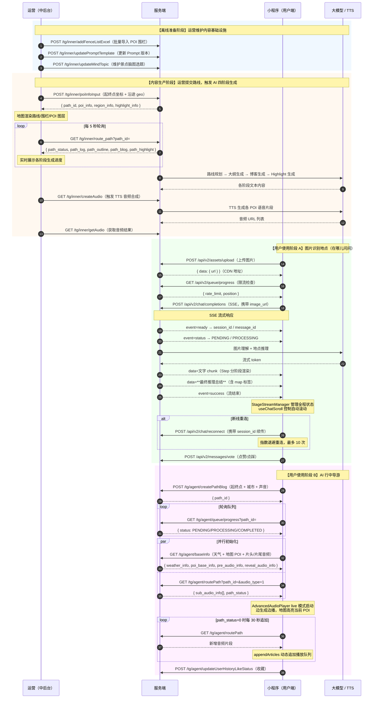

# 郭亚平

**求职岗位：前端工程师**

1993 | 安徽阜阳 | 8 年经验 | 18326019819 | pxl_0510@163.com

---

## IT 技能

- **技术栈**：熟悉 React 及其生态，具有多端（PC H5 小程序）开发能力，熟悉 Webpack 构建工具，具备性能优化意识与实践经验，熟悉 Monorepo 搭建组件库流程
- **AI 集成**：OpenAI/大模型 API 调用、流式处理（SSE/WebSocket）、生成式 UI 渲染、LangChain.js
- **工程化**：熟练使用 Git Hooks、ESLint、Commitlint、Prettier 等工具规范代码；具备 CI/CD（GitLab、Drone）自动化部署经验；了解 Docker、Nginx、PM2 等部署工具
- **性能优化**：有一定的实践经验，追求极致体验，熟悉 Webpack、数据懒加载、SWR、Web Worker 优化技术
- **微前端**：icestark qiankun 实践，有一定的实战经验
- **其他**：了解前端监控等稳定性治理手段

---

## 工作经历

### 滴滴出行 LLab &emsp; 2025.06 – 至今

- AI 方向应用探索：图搜地点，行中景点博客生成及语音讲解项目落地等
- 主导微信小程序、中后台等项目

### 阿里巴巴 电商 ICBU &emsp; 2023.12 – 2025.03

- 负责海外商品域：AI 惠普，利用 AI 搬品、AI 极简征品实现商品有质量的规模化上翻；交易化 by 国家链路 0-1，实现商品易达
- 负责海外商增域：入驻流程国别化打通，AI 极简认证，付费方式本地化，提高转化率
- 通过打点分析、数据报表驱动业务优化，提升用户体验
- 主导商品管理、发品表单等模块的架构升级，统一 UI 样式，稳定性治理，代码质量把控
- 负责性能优化，确保关键页面 90 分位 FCP < 1000ms、LCP < 2000ms、CLS < 0.02、INP < 200ms

### 科大讯飞 消费 BG 开放云平台 &emsp; 2020.03 – 2023.08

- 支撑 6 大 AI SaaS 平台及私有化部署，1024 开发者节（三届主力参与），后台综合管理平台（1000 人）
- 主导工程化搭建与升级，开发门户配置平台，提升开发效率
- 落地微前端架构，整合综合管理、CMS、数据看板系统，节约人力成本
- 通过日志上报、用户行为分析驱动产品迭代

### 上海优刻得科技（UCloud）云计算 &emsp; 2018.07 – 2020.03

- 云计算 PaaS 产品线 IOT 部门的物联网通信云平台，全球动态加速业务；前者架起设备与云服务连接的桥梁，后者提升应用在全球访问质量的网络加速产品

---

## 项目经历

### 在哪儿问问 · 行中导游 &emsp; 滴滴

**项目目标**：图搜地点，行中景点博客生成及语音讲解，实现微信小程序与中后台相关功能

**核心技术**：Taro 4 · React 18 · TypeScript · SSE · eventsource-parser · lottie · markdown-it

**核心成果**：

- **可复用流式通信协议层**：微信小程序不支持 EventSource，无法直接套用浏览器 SSE 方案；设计传输层（wx.request enableChunked）/ 解析层（eventsource-parser + 自实现 MockTextDecoder）/ 消费层三层解耦架构，业务代码不感知底层传输方式；引入背压控制，当消费速度落后于生产时策略性丢弃非关键 chunk，避免 buffer 无限堆积导致 OOM；版本嗅探自动降级兼容低版本基础库；整套方案与业务完全解耦，已抽离为独立模块可复用至任意小程序流式场景

- **AI 多阶段状态机 + 生成式 UI 渲染引擎**：AI 四阶段生成（路线 → 大纲 → 播客 → Highlight）本质是一个复杂状态流转过程，用 if/else + 魔法数字难以维护；以状态机思想建模，每个阶段是独立状态节点，转换有类型约束，失败携带具体阶段信息支持断点续接重试；渲染侧设计 chunk 解析 → 状态归一 → 输出三层管道，StageStreamManager 收敛流式会话全生命周期（字符级限流打字机输出、正则多阶段解析、指数退避重连），整套方案可独立测试、与具体业务解耦

- **流式场景专项滚动方案**：AI 高频 chunk 更新与用户手势天然存在竞争，通用滚动组件无法直接复用；深入分析冲突根因后，设计 useChatScroll Hook 解决该类场景的通用问题：程序滚动与用户手势分离、callCountRef 节流降低重绘压力、近底部阈值检测实现自动跟随与即时停止的平衡、flush() 补偿保证末尾内容可见；已沉淀为与业务无关的通用 Hook，适配任意流式内容渲染场景

- **通用多段音频引擎**：AI 边生成边播场景中，音频与文本流天然异步，且存在 CDN 链接过期、长路线内存泄漏、段间停顿等工程问题，通用播放器无法覆盖；设计 AdvancedAudioPlayer 抽象该类场景的播放模型：live/playback 双模式统一接口；N+1 预加载策略消除段间停顿；滑动窗口内存管理（当前 ±2 段），窗口外主动 destroy 解决长路线内存泄漏；跨段累计时长定位采用二分遍历，seek 卡死双层超时兜底；引擎与 SSE 数据层解耦，可复用至任意多段流式音频场景

- **前端参与质量门禁的 Prompt 工程化平台**：Prompt 模板变量错误通常需要跑完 AI 流程才能发现，成本极高；设计前端质量前移方案：解析模板文本提取占位符变量，对比合法 Schema 实时提示非法变量，沙箱预览填入真实景点数据展示最终 prompt 效果，将错误发现时机从"AI 跑完"前移至"提交前"；版本管理采用类 Git 模型（自增版本号、全量历史留存、任意回滚），结合 AI 四阶段生成可观测看板与地图多图层可视化，构建可回滚、可追溯的生产级 AI 内容工厂后台

---

### 自动化骨架屏（Smarty Skeleton）&emsp; 阿里巴巴

**项目目标**：针对海外弱网环境，在 JS 资源或接口加载完成前显示骨架屏以缓解等待焦虑；以无感知化、精细化接入、高还原度、高视觉稳定性为设计目标，并推广商家后台全面接入

**核心技术**：localStorage · IndexedDB · Chrome 插件 · EJS · CI/CD · NPM · Monorepo · dumi

**核心成果**：

- 高还原度、无感知接入，提效 0.5 人日+；形成规范，推广至其他团队，海外场景（20+ 页面）全面接入
- 沉淀 JS SDK（缓存版本），千人千面地自动生成 Skeleton 保存至 IndexedDB，拔高 FP 性能极限 < 500ms，在 JS 脚本解析完成前提前占位，解决白屏焦虑及布局抖动；CLS：0.01X → 0.00X
- Chrome 插件可视化生成 Skeleton，通过 API Server 操作 git 仓库，根据 EJS 模板新增组件，触发 Git Actions 自动更新组件库文档及发布 NPM 包，达到可视化预览及按需引入的目的

---

### 基础体验治理 &emsp; 阿里巴巴

**项目简介**：商家海外业务代码 fork 自国内业务，架构陈旧，国别化本地体验问题严重，用户设备落后

**核心成果**：

- **性能优化**：CSR + SSR + SWR 架构，沉淀性能优化 checklist，负责页面 90 分位 FCP < 1000ms、LCP < 2000ms、CLS < 0.02、INP < 200ms；LCP 元素同构直出 4000ms → 1600ms；列表懒加载 + immutable 减少大对象监听 + 行为上报长任务拆分 INP 500ms → 160ms；Service Worker 预热 + CDN 分发实现 FCP 约 600ms
- **国际化升级**：I18n 方案升级，8 → 1 种语言 CDN 动态加载，加载时长 2.5s → 1s，支持 SWR，反显语言 key 方便纠错
- **架构收敛**：icestark 实现 MPA → SPA 无刷新迁移；React 版本升级；SWR 封装 useI18nSource、useCacheState、useIndexDB 等；发品表单 207 个组件与主应用合并，发布流程提效
- **UI 治理**：基于基础组件库二次封装，组件库收口，节省前端需求开发时间及 UI 回归时间，解决 UI 风格不统一问题

---

### AI 百宝箱 · 智能翻译平台 · 城市站 · OCR 规则训练平台等 &emsp; 科大讯飞

**项目目标**：创建六个 SaaS 平台（前三者盈利，均为部门重点项目），并实现私有化部署；涉及语音转写、文档/文本/语音/视频翻译、OCR 识别等 AI 能力

**核心技术**：React · Next · Redux · Vite

**核心成果**：

- 50M 大文件切片上传：并发请求限制减轻服务器压力，支持批量、取消、IndexedDB 缓存及断点续传
- canvas 提取图片框选区域坐标，不随拖拽缩放改变，实现 OCR 精准识别及显示
- 沉淀前端 Docker 镜像多阶段构建方案，构建体积 GB → XXM；缓存分层策略，构建时间 1Xmin → 4min；支持门户、控制台、服务市场、文档中心、综合管理平台等十余项目私有化部署
- 利用 qiankun 落地微前端，整合综合管理、CMS、数据看板系统，节约人力成本
- 建立前端监控体系，收集各类错误信息，通过日志上报快速定位问题，提升系统稳定性

---

### 1024 开发者节（PC · H5 · 小程序）&emsp; 科大讯飞

**项目简介**：以 AI 开发者为受众群体的人工智能盛会，负责报名、游戏、大会议程、个人中心、积分商城等核心模块，支持现场 4W+ 用户零故障

**核心技术**：React · Taro · Next · WebSocket

**核心成果**：

- Taro 实现 H5 + 小程序跨端开发；小程序首屏渲染 2200ms → 1200ms，主包体积 2.5M → 1.8M，WXML 节点数 1500 → 800
- 报名表单 Schema 配置化，五种票型复用同一模块，兼容活动变动，人效 14d → 3d
- 实现 PC/H5/微信小程序/微信内置浏览器四端支付（4W+ 用户），沉淀可复用支付 NPM 包
- Webpack Plugin 实现图片压缩及上传；PC 端打包体积 4M → 500KB（gzip），构建时间 30s → 10s

---

## 系统时序图：在哪儿问问 · 行中导游

---

## 教育背景

**华中科技大学** · 湖北武汉 &emsp; 2015 – 2018
硕士 · 光电（保送）

**浙江工业大学** · 浙江杭州 &emsp; 2011 – 2015
学士 · 理学院
