# 技术架构与时序图 · Markdown 流式对话 Demo

> 与代码实现一一对应。Mermaid 图，IDE / GitHub 直接渲染。
> 对应方案文档：`../A2UI-最佳实践与架构方案.md` §6.6。

---

## 1. 分层架构

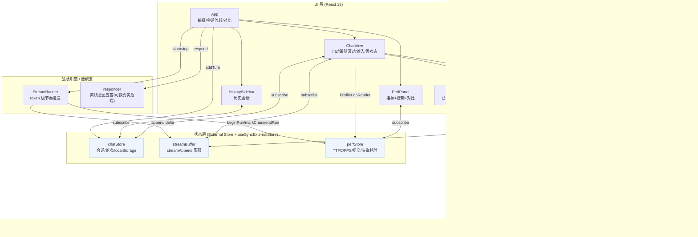

要点：
- 三个 **External Store**（`chatStore` / `streamBuffer` / `perfStore`）是单一事实来源，UI 通过 `useSyncExternalStore` 订阅，天然并发安全。
- `responder` 是**接真实后端的接缝点**：换成 SSE / `streamAppend` 服务端流即可，渲染/记忆化/历史/滚动逻辑全部不变。

---

## 2. 渲染数据流（流式 → 像素）

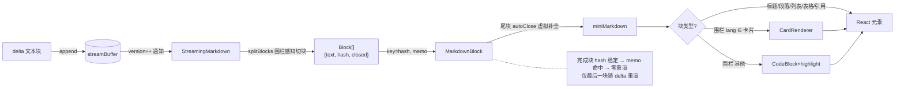

---

## 3. 时序图：一次多轮对话（发送 → 流式 → 落库）

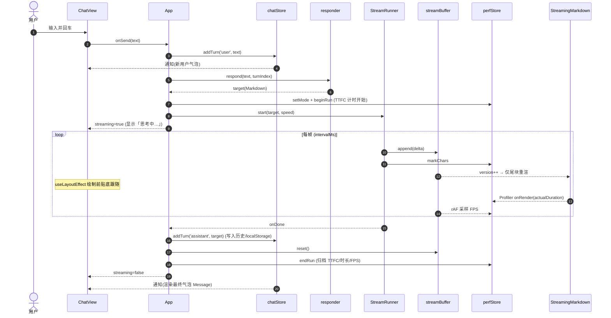

---

## 4. 时序图：块级记忆化（为何流式不卡）

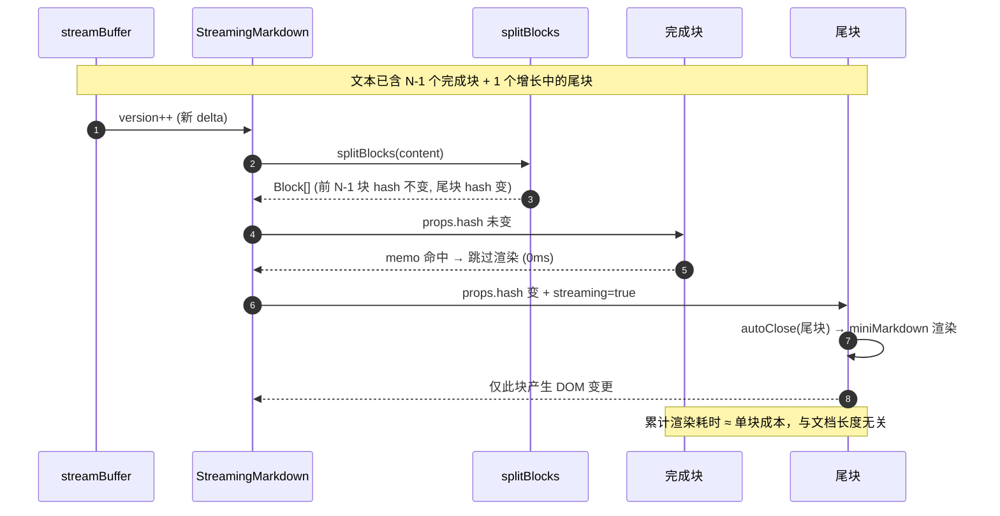

---

## 5. 时序图：从历史进入（瞬时定位底部，无滑动动画）

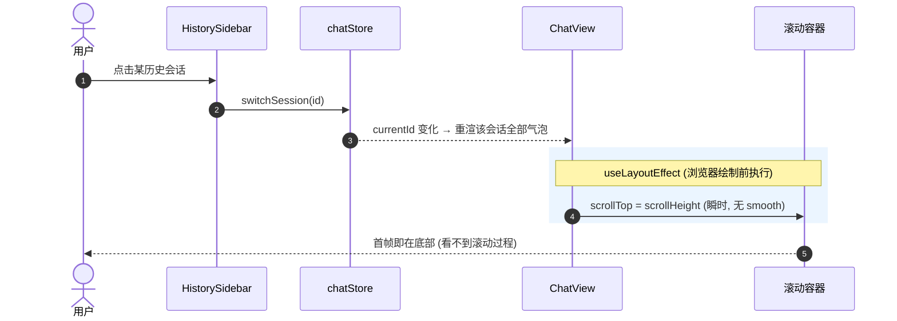

对比修复前：用 `useEffect`(绘制后) + CSS `scroll-behavior:smooth` → 先画在顶部再平滑滚下去（可见滑动）。
修复后：`useLayoutEffect` 绘制前定位 + 去除 smooth → 首帧直达底部。

---

## 6. 时序图：性能对比（记忆化 vs 朴素）

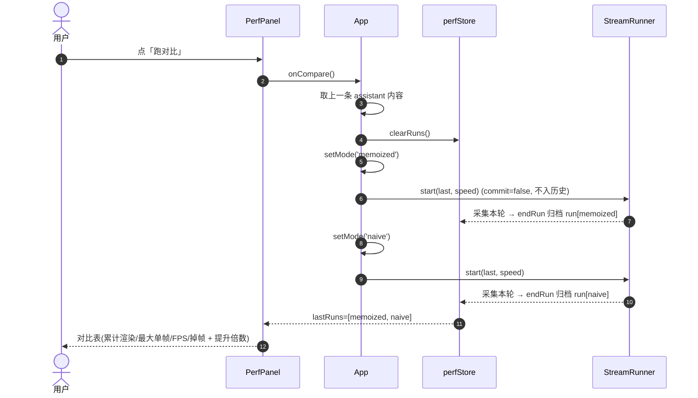

---

## 7. 状态模型

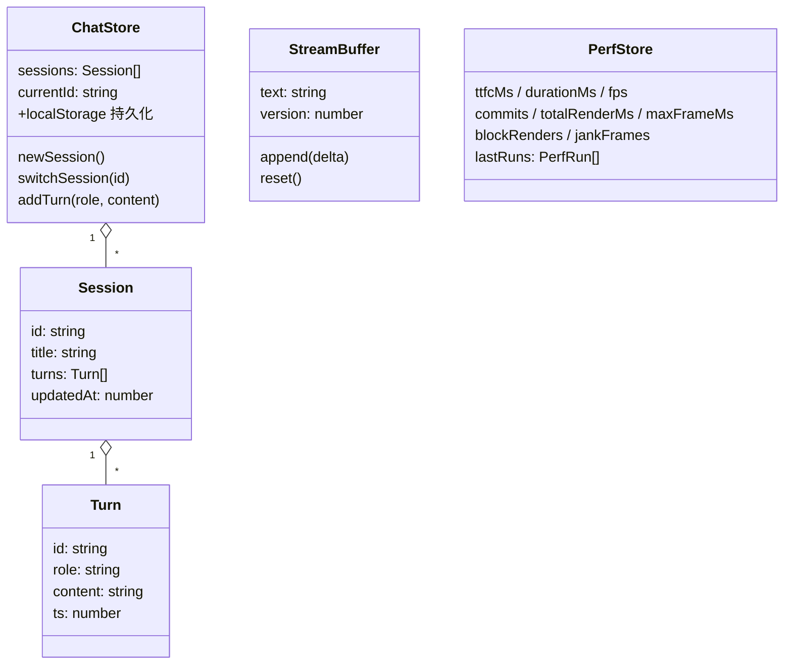

---

## 8. 对接真实 A2UI / LLM（演进路径）

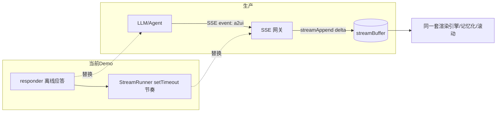

> 关键：流式渲染引擎、块级记忆化、历史、滚动策略与数据源解耦。把 `responder + StreamRunner` 换成 `SSE 网关 + streamAppend`，前端零改动。

---

## 9. 增量内核（B 级）· 类图

> 对应 `spec.md` / `plan.md`。`StreamingMarkdown` 按 `mode` 分发：`incremental` → `IncrementalMarkdown`（本节），`memoized/naive` → `ClassicMarkdown`（§2）。
> 内核 `src/imd/` **框架无关、零依赖**，由 34 个 vitest 用例守护（含「流式==原子」property 测试）。

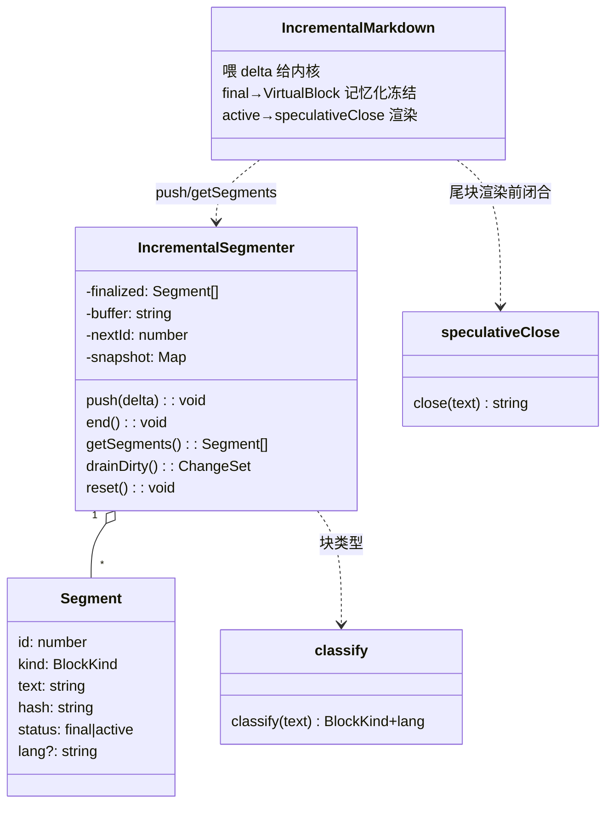

不变式：① final 段 id/hash 跨 push 稳定；② 至多 1 个 active；③ 围栏未闭合保持 active；④ 任意切片 `push`+`end` 结果 == 一次性解析。

---

## 10. 时序图：增量解析 + 投机闭合（O(尾块)）

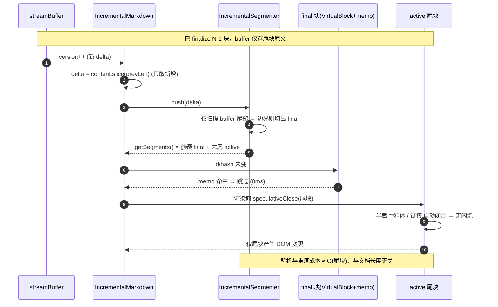

对比记忆化（§4）：记忆化每 token 仍 `splitBlocks(全文)`（O(n) 字符串扫描）；增量内核只 `push(delta)`（O(尾块)）→ 长文档差距随块数放大。

---

## 11. 时序图：离屏块虚拟化（恒定 DOM）

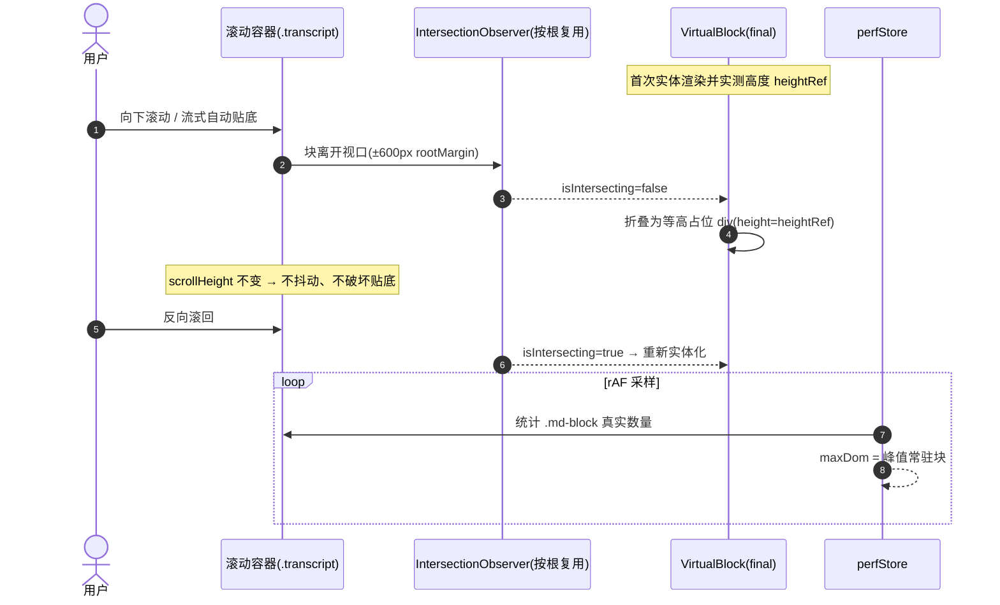

效果：超长文档（160 节）流式时，**常驻块(DOM)** 保持恒定（可见区相关），而朴素/记忆化随文档线性增长。

---

## 12. 三模式对比（同一份内容 / 同一流速）

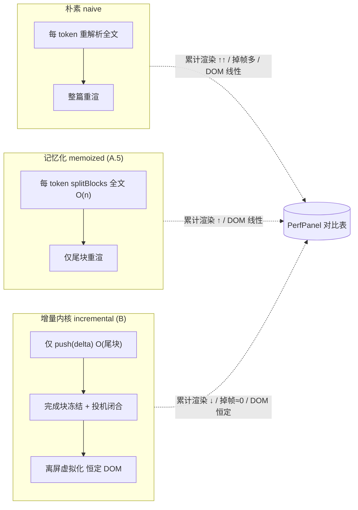

> 触发方式：发送「**超长文档压测（虚拟化）**」→ 生成 160 节长文（`samples/longDoc.ts`，模拟后端）；右侧面板「⚡ 跑对比」一次串跑三模式，对比 `累计渲染 / 最大单帧 / 平均FPS / 掉帧 / 常驻DOM块`。
