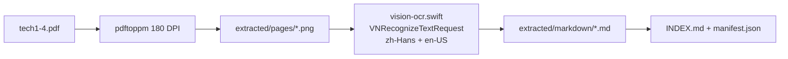

# A2UI / GenUI 技术文档提取方案

## 1. 源材料分析

| 文件 | 页数 | 大小 | 类型 | 主题 |
| --- | ---: | ---: | --- | --- |
| tech1.pdf | 4 | ~6.1 MB | 截图型 PDF（无文本层） | A2UI 实战（一）渲染器基础 |
| tech2.pdf | 2 | ~3.5 MB | 截图型 PDF | A2UI 实战（二）SSE / AGUI / 服务端 |
| tech3.pdf | 11 | ~20 MB | 截图型 PDF | A2UI 实战（三）图片理解 / 多轮对话 |
| tech4.pdf | 22 | ~36 MB | 截图型 PDF | 生成式 UI 与 A2UI 概念体系 |

**关键结论**：4 份 PDF 均为 JPEG 内嵌的截图文档，`pypdf` / `pdftotext` 无法直接提取文字，必须走 **渲染 + OCR** 管线。

---

## 2. 方案对比

| 方案 | 优点 | 缺点 | 结论 |
| --- | --- | --- | --- |
| A. 直接 `pdftotext` | 最快 | 对本目录无效（0 字符） | ❌ 不可用 |
| B. Tesseract OCR | 开源、可离线 | 本机未安装；中文排版恢复弱 | ⚠️ 备选 |
| C. 云端 Vision API | 识别率高 | 需联网、有成本、隐私风险 | ⚠️ 备选 |
| D. **macOS Vision + pdftoppm** | 原生中文支持好、离线、免费 | 需 Swift/Python 脚本 | ✅ **选用** |
| E. 人工逐页复制 | 准确率最高 | 39 页耗时大 | ❌ 不 scalable |

---

## 3. 最佳方案（已实施）



### 3.1 工具链

1. **Poppler `pdftoppm`**：将 PDF 页渲染为 PNG（180 DPI，兼顾清晰度与体积）
2. **`vision-ocr.swift`**：调用 macOS Vision Framework，`recognitionLevel = accurate`，语言 `zh-Hans, en-US`
3. **`extract.py`**：批量编排、生成 Markdown / 索引 / manifest

### 3.2 输出结构

```
genui/tech/
├── tech1.pdf … tech4.pdf      # 原始 PDF
├── extract.py                 # 一键提取脚本
├── vision-ocr.swift           # macOS Vision OCR
└── extracted/
    ├── pages/                 # 39 页 PNG 快照
    ├── markdown/
    │   ├── tech1.md … tech4.md
    ├── INDEX.md               # 人类可读索引
    ├── manifest.json          # 机器可读元数据
    └── EXTRACTION_PLAN.md     # 本文档
```

### 3.3 Markdown 格式约定

- 每个 PDF 对应一个 `.md` 文件
- 按页分节：`## 第 N 页`
- 每节保留 OCR 文本 + 原页图片引用（便于校对）
- 顶部元数据：来源文件、页数、提取方式

---

## 4. 内容架构与学习路径

文档构成 **A2UI 四阶段实战 + 概念总览**：

| 阶段 | 文档 | 核心产出 |
| --- | --- | --- |
| 概念 | tech4 | 生成式 UI 定义、场景、A2UI 协议价值 |
| 实战一 | tech1 | `@a2ui/core`（Parser / TreeBuilder / Store）+ `@a2ui/react` |
| 实战二 | tech2 | SSE 流式传输、AGUI 协议、Koa 服务端 |
| 实战三 | tech3 | Vision LLM 识图、多轮状态、元素级 Click→Quote→Modify |

**推荐学习顺序**：tech4 → tech1 → tech2 → tech3

---

## 5. 复现命令

```bash
cd "/Users/didi/Downloads/前端AI面试题/genui/tech"
python3 extract.py
```

依赖：

- macOS（Vision Framework）
- Poppler：`pdftoppm`、`pdfinfo`（Homebrew `poppler`）
- Swift（Xcode Command Line Tools）

---

## 6. 质量说明与后续优化

OCR 对 UI 截图中的图标、表格、代码块可能存在：

- 导航栏噪声（如「分享」「Q+」）
- 英文大小写混淆（A2UI → A2U1）
- 表格结构丢失

**建议后续步骤**（按需）：

1. 对照 `extracted/pages/` 图片人工校对关键章节
2. 将 tech1–tech3 合并为 `A2UI-实战合集.md`，tech4 单独作为概念篇
3. 若需全文检索 / RAG：对 Markdown 按 `##` 标题 chunk，embedding 入库
4. 若识别率仍不足：对代码块区域单独提高 DPI（240）二次 OCR

---

## 7. 与面试 / 项目的关系

该目录内容可直接支撑：

- **GenUI / A2UI** 技术面试（协议、渲染器、SSE 选型）
- **前端 AI 作品集** 中的多模态渲染引擎叙事
- **从零实现 A2UI SDK** 的分阶段 MVP 路线

原始附件（文档中提及）：

- `a2ui-full.tar.gz` / `a2ui-full-source.tar.gz` — 完整源码包
- `specification_v0_8.zip` — A2UI 协议规范

如需下一步，可将 OCR 后的 Markdown 进一步 **结构化** 为面试题卡片或 SPEC 文档。
