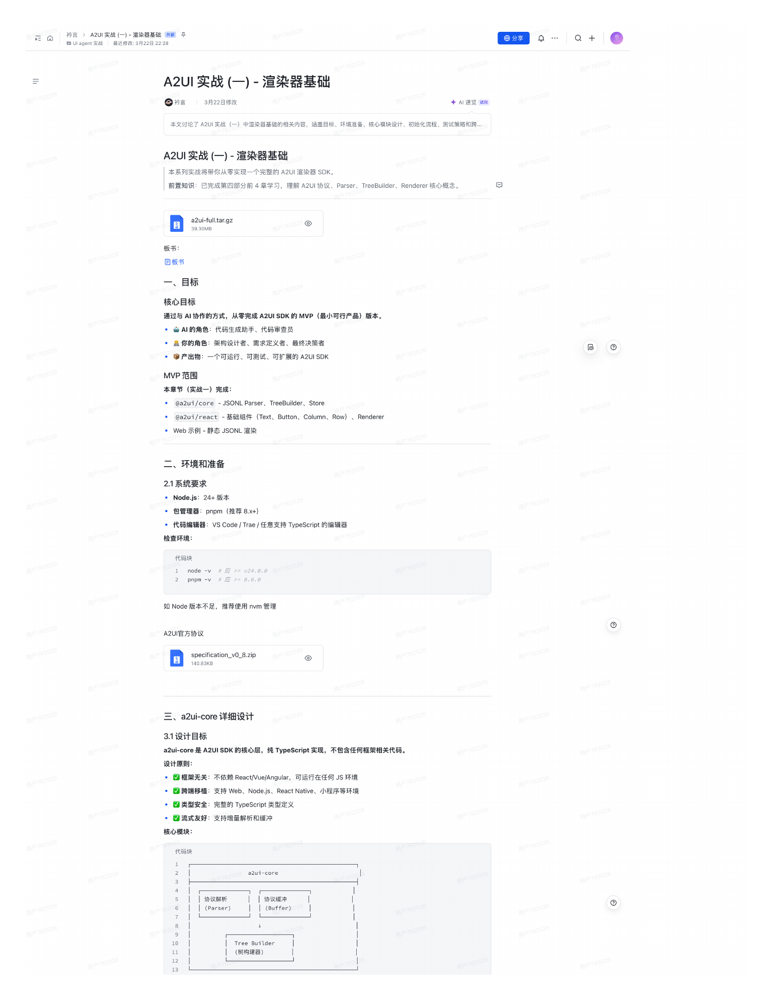
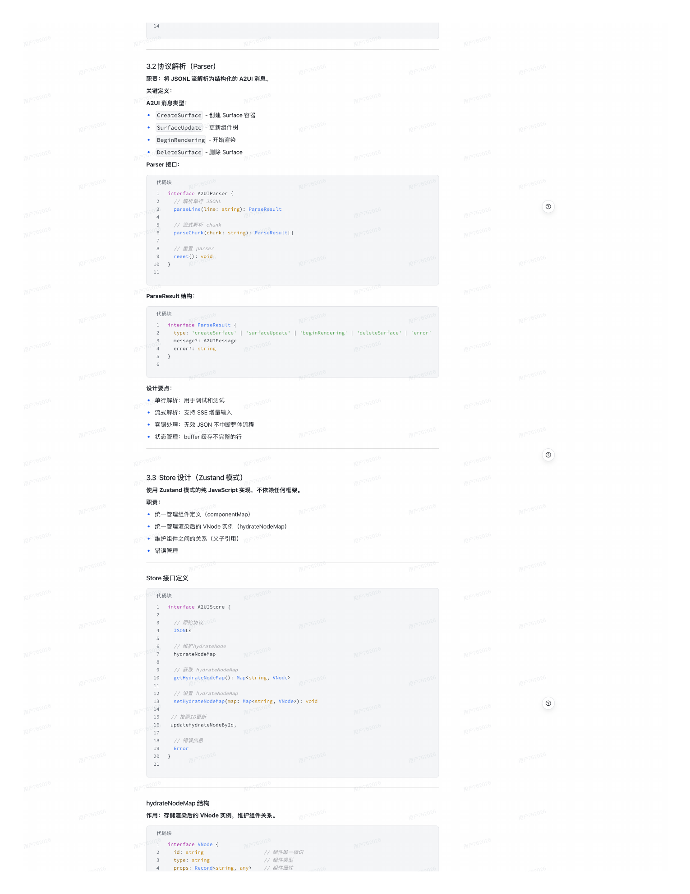
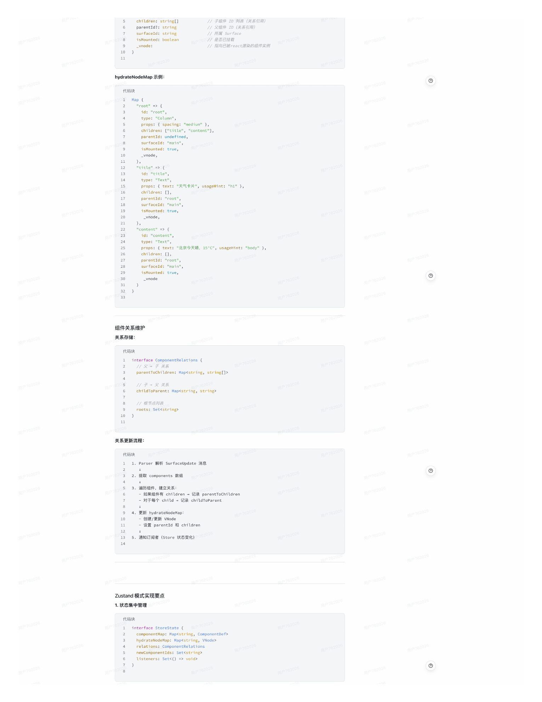
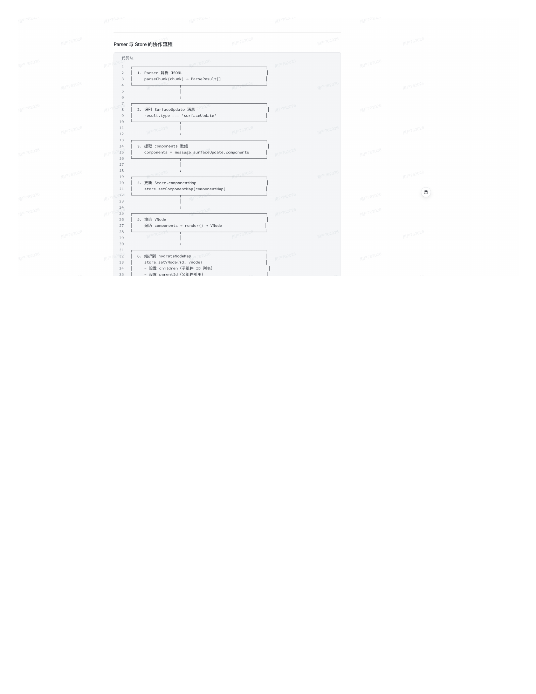

# A2UI 实战（一）- 渲染器基础

> 来源: `tech1.pdf` | 共 4 页 | 提取: pdftoppm 180DPI + macOS Vision OCR

---

## 第 1 页

衿言 >A2UI 实战（一）-渲染器基础 外 平
冊分享
〇十

A2UI 实战（一）-渲染器基础

◎衿言
3月22日修改
今 AI速览 诚用

本文讨论了 A2UI 实战（一）中渲染器基础的相关内容，涵盖目标、环境准备、核心模块设计、初始化流程、测试策略和跨⋯

A2UI 实战（一）-渲染器基础

本系列实战将带你从零实现一个完整的 A2UI渲染器 SDK。

前置知识：已完成第四部分前 4章学习，理解 A2UI 协议、Parser、TreeBuilder、Renderer 核心概念。

39.30MB

板书：

目板书

一、目标

核心目标

通过与 AI 协作的方式，从零完成 A2UI SDK 的 MVP（最小可行产品）
版本。

•AI 的角色：代码生成助手、代码审查员

•品你的角色：架构设计者、需求定义者、最终决策者

••产出物：一个可运行、可测试、可扩展的 A2UI SDK

MVP 范围

本章节（实战一）完成：

• @a2ui/core - JSONL Parser、
TreeBuilder、Store

@a2ui/react-基础组件（Text、Button、Column、Row）、Renderer

• Web 示例- 静态 JSONL 渲染

二、环境和准备

2.1系统要求

• Node.js: 24+ 版本

• 包管理器：pnpm（推荐8.x+）

• 代码编辑器：VS Code / Trae/任意支持 TypeScript 的编辑器

检查环境：

代码块
#面>= V24.0.0
#>= 8.0.0

如 Node 版本不足，推荐使用 nvm 管理

A2UI官方协议

specification_vo_8.zip

三、a2ui-core 详细设计

3.1设计目标

设计原则：
a2ui-core是 A2UISDK的核心层，纯TypeScript实现，不包含任何框架相关代码。

•囗框架无关：不依赖 React/Vue/Angular，可运行在任何JS环境

• 跨端移植：支持 Web、Node.js、React Native、小程序等环境
• 辽类型安全：完整的 TypeScript 类型定义

• 辽流式友好：支持增量解析和缓冲

核心模块：

用户762028

协议解析
协议緩冲

Tree Builder

---

## 第 2 页

3.2协议解析（Parser）

职责：将JSONL流解析为结构化的 A2UI消息。

关键定义：

A2UI消息类型：

• CreateSurface - 创建 Surface 容器

• SurfaceUpdate -更新组件树

BeginRendering - 开始渲染

DeleteSurface - 删除 Surface

Parser 接口：

代码块
ancerTace -earsem

parseLine（Line: string）：ParseResult

parsechunk（chunk:string）： ParseResult0］
// 流式解析 chunk

reset（）：void
//重置 parser

10
用户762021

ParseResult结构：

代码块
intertace Parsekesult

message？： AZUIMessage
type：'createSurface'|'surfaceUpdate'|'beginRendering'| 'deleteSurface'| 'error"

error？：string

设计要点：

•单行解析：用于调试和测试

• 流式解析：支持 SSE 增量输入

• 容错处理：无效 JSON 不中断整体流程

• 状态管理：buffer 缓存不完整的行

3.3 Store 设计（Zustand 模式）

使用 Zustand 模式的纯 JavaScript 实现，

职责：
不依赖任何框架。

• 统一管理组件定义 （componentMap）

• 统一管理渲染后的 VNode 实例 （hydrateNodeMap）

• 维护组件之间的关系（父子引用）

•错误管理

Store 接口定义

代码块
intertace AzulStore/

JSONLS
// 原始协议

hydrateNodeMap
// 維护hydrateNode

gethyaravenogemapw• MapssuhTng，
// 获取 hydrateNodeMap

setHvdrateNodeMap（map: Mancstring, VNode>）： void
//发 hvdrateNodelag

upealenvor2wewoneswd
// 按照ID更新

Error
// 锚埃信总
用户762026

用户76202

hydrateNodeMap 结构

作用：存储渲染后的 VNode 实例，维护组件关系。
用户762026

代码块

262Sr1ng
用户762026

type: string
// 組件唯一标识

props:Recordsstring,any>
// 组件履性
// 組件类型

---

## 第 3 页

parenuLd：. suhing
// 子组件 ID 列表（关系引用）

isMounted: boolean
surfaceId:string
// 父组件 ID（关系引用）
// 所属 Surface

-vnode：
// 指向已被react渲染的组件实例
7/ 是否已挂裁

hydrateNodeMap 示例：

代码块

"root"=
id："root"，

props： ｛ spacing："medium" ｝，
type："Column"，

parentId: undefined，
children： ［"title"， "content"］，
用户762026

isMounted:true，
surfaceId： "main"，

-vnode，

"title" =>｛

type："Text"，
id： "title"，

children： ［］，
props： ｛ text： "天气卡片"，usageHint：
"h1"｝，

parentId："root"，
surfaceId： "main"，
1Snounweo•rrue，

了，
_vnodc，
用户762026

22
id： "content"，

props： ｛ text："北京今天晴，15°C"，usageHint："body" ｝，
type："Text"，

children：［］，

28
surfaceId："main"，
parentId： "root"，

isMounted: true，
-vnode

3233

组件关系维护

关系存储：

代码块
intertace componentke Lations t

parentToChildren: Mapsstring, string［］>

childToParent: Mapsstring,string>
//子 父关系

roots: Setsstring>
// 根节点列表

关系更新流程：

代码块

1.Parser 解析 SurfaceUpdate 消息

2. 是取 components 数組

3.遍历组件，建立关系：

- 对于每个 child -记录 childToParent
- 如果組件有 children -记录 parentToChildren
用户762026
用户762026

4. 更新 hydrateNodeMap：
- 创建/更新 VNode
-设置 parentId 和 children
用户762026

5.通知订阅者（Store 状态变化）

Zustand 模式实现要点

1.状态集中管理

代码块

componentMap: Mapsstring, ComponentDef：
nvaraeoseman. Mapssunine. Vheoen

neuconooneleas. oenssmn
Listeners: Setc（） => void>

用户762026

---

## 第 4 页

Parser 与 Store 的协作流程

代码块

1. Parser 群价 3SONL
parsecnunk chunk）
• ParsekesuLt

2. 识H SurfaceUpdate
result.tvpe === 'surfacelpdate'
泪忌

用户762021
日 76202|

3. 优取 components 数浴
comoonents = message.sur facevodate.Comoonents

4. 更溯 Store.componentMap
store.setComponentMap（componentMap）

27
运历 components • render（） - VNode
汩染 VNooe

28

6. 维护型 hvdrateNodeMap
store.setvNode（1d, vnode，

---
