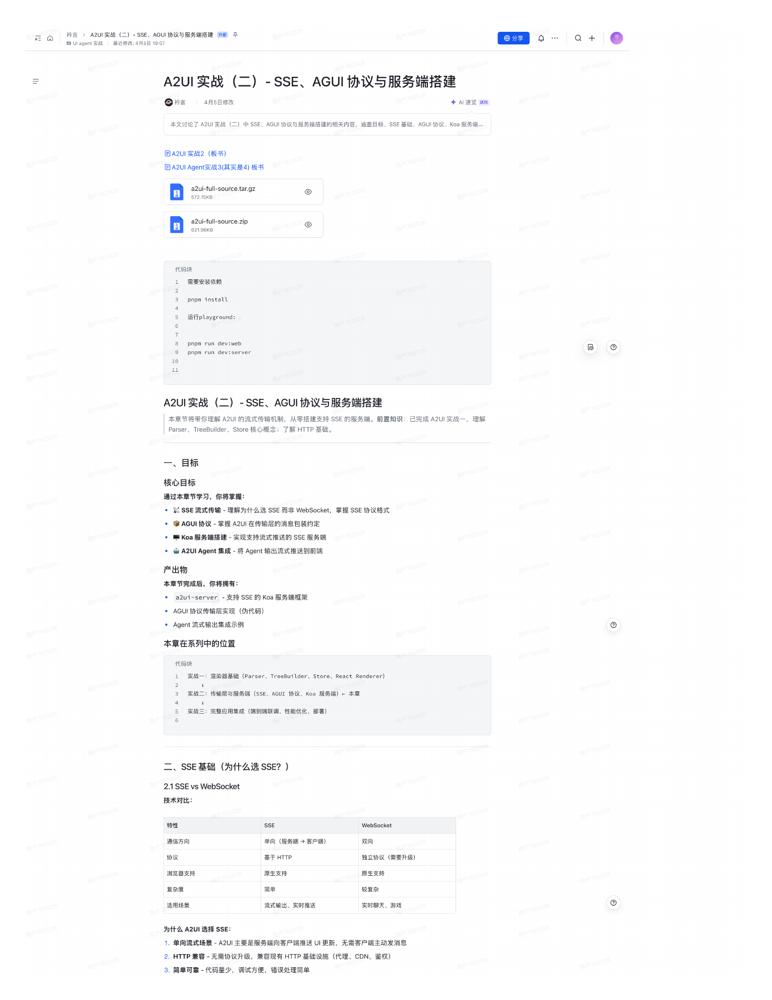
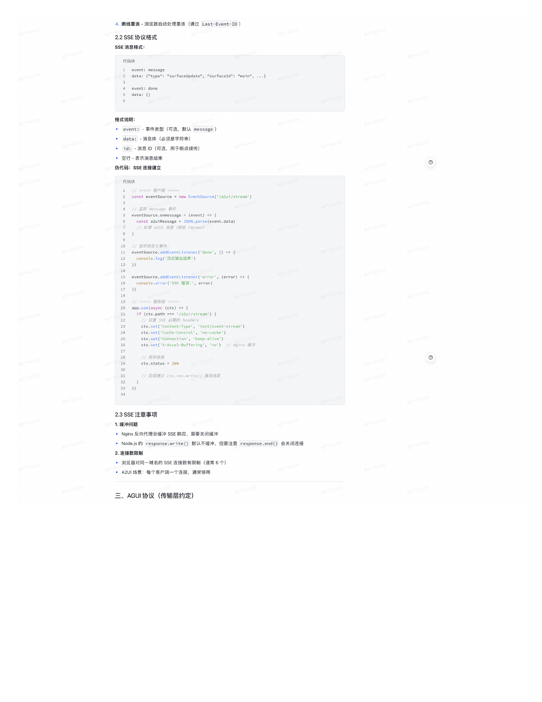

# A2UI 实战（二）- SSE、AGUI 协议与服务端搭建

> 来源: `tech2.pdf` | 共 2 页 | 提取: pdftoppm 180DPI + macOS Vision OCR

---

## 第 1 页

a uaaentSa
衿言 >A2UI 实战（二）-SSE、AGUI 协议与服务端搭建 外部平
冊分享
〇十

A2UI 买战（二）- SSE、AGUI 协议与服务端搭建

◎衿言
4月5日修改
今 AI 速览 试用

本文讨论了 A2UI 实战（二）中SSE、AGUI 协议与服务端搭建的相关内容。涵盖目标、SSE 基础、AGUI协议、Koa服务端..

目A2UI 实战2（板书）

目A2UI Agent实战3（其实是4）板书

a2ui-full-source.tar.gz

621.96KB
a2ui-full-source.zip
◎

代码块

需要安装侬赖

pnpm install

运行playground：

pnpm run dev:web
pnpm run dev:server

A2UI 实战（二）-SSE、AGUI 协议与服务端搭建

Parser、TreeBuilder、Store 核心概念；了解 HTTP 基础。
本章节将带你理解 A2UI的流式传输机制，从零搭建支持 SSE 的服务端。前置知识：已完成 A2UI 实战一，理解

一、目标

核心目标

通过本章节学习，你将掌握：

• SSE 流式传输 -理解为什么选 SSE 而非 WebSocket，掌握 SSE 协议格式

• 寧 AGUI 协议- 掌握 A2UI 在传输层的消息包装约定

• Koa 服务端搭建 - 实现支持流式推送的 SSE 服务端

•』 A2UI Agent 集成-将 Agent 输出流式推送到前端

产出物

本章节完成后，你将拥有：

• a2ui-server - 支持 SSE 的 Koa 服务端框架

• AGUI 协议传输层实现（伪代码）

• Agent 流式输出集成示例

本章在系列中的位置

代码块

实战一：渲染器基础 （Parser、TreeBuilder、Store、React Renderer）

实战二：传输层与服务端（SSE、AGUI 协议、Koa 服务端）-本章

实战三：完整应用集成（端到端联调、性能优化、部署）

二、SSE 基础（为什么选 SSE？）

2.1 SSE vs WebSocket

技术对比：

特性

渔信方向
单向（服务端 客户端）
双向

协议
基于 HTTP
独立协议（需要升级）

浏览器支持
原生支持
原生支持

复杂度
简单
较复杂

适用场景
流式输出、实时推送
实时聊天、游戏

为什么 A2UI选择 SSE：

1.单向流式场景-A2UI 主要是服务端向客户端推送 UI 更新，无需客户端主动发消息

2. HTTP 兼容- 无需协议升级，兼容现有 HTTP 基础设施（代理、CDN、鉴权）

3. 简单可靠-代码量少，调试方便，错误处理简单

---

## 第 2 页

4. 断线重连- 浏览器自动处理重连（通过 Last-Event-ID）

2.2 SSE 协议格式

SSE 消息格式：

data：｛"type"："surfaceupdate"，"surfaceId"："main"， •.｝

格式说明：

event：-事件类型（可选，默认 message）

data：-消息体（必须是字符串）

• id：-消息ID（可选，用于断点续传）

• 空行 -表示消息结束

伪代码：SSE 连接建立

代码块
-===- 就口（ 1===1

eventsource.onmessage = （event=L
，监号 message 專件

const a2uiMessage = JSON.parse（event.data）

// 监听自定义要件

eventSource.addEventListener（"done"， （） => ZP762025
console.1og（'流式输出结束：）

14
15
16
eventSource.addEventListener（error'， （error） =>｛

17
console.error（'SSE 错误：'，error）

===== 股务喵
用户762021

if （ctx.path === '/a2ui/stream'）｛

CtX.set（ Content- ype, text/event-stream）
造 SSE 多濃的 headers

ctx.set （'Connection'，'keep-alive'）
ctx.set（'Cache-Control'，'no-cache'）

ctx.set（'X-Accel-Buffering'，'no'）
// Nginx 緩冲
用户762026

28
// 保持连接

30
ctx.status = 200

31
32
// 后续通过 ctx.res.write（）推送消息

2.3 SSE 注意事项

1. 缓冲问题

• Nginx 反向代理会缓冲 SSE 响应，需要关闭缓冲

• Node.js 的 response.write（）默认不缓冲，但要注意response.end（）会关闭连接

2. 连接数限制

• 浏览器对同一域名的 SSE 连接数有限制（通常6个）

• A2UI 场景：每个客户端一个连接，通常够用

三、AGUI 协议（传输层约定）

---
