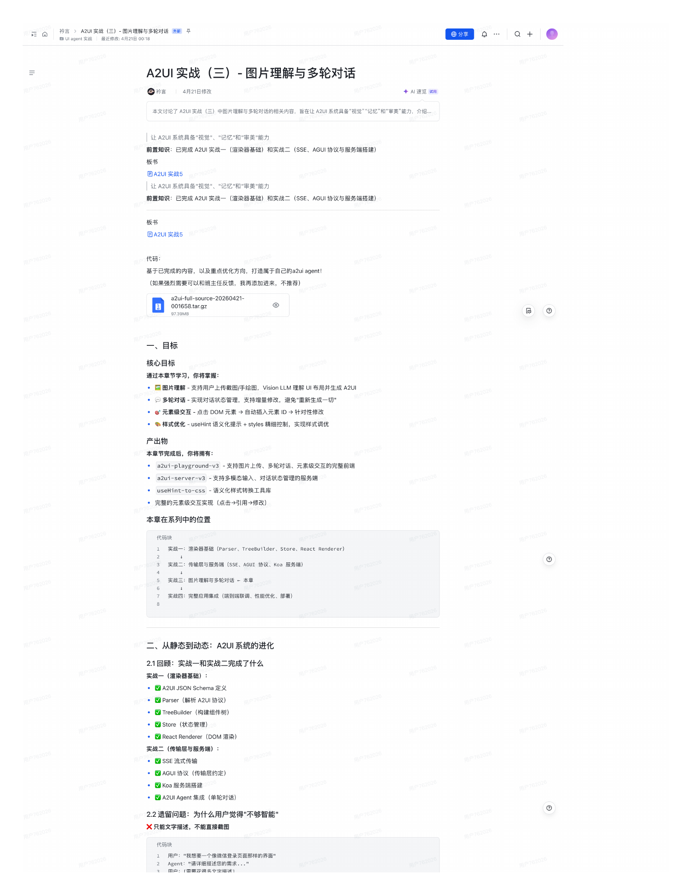
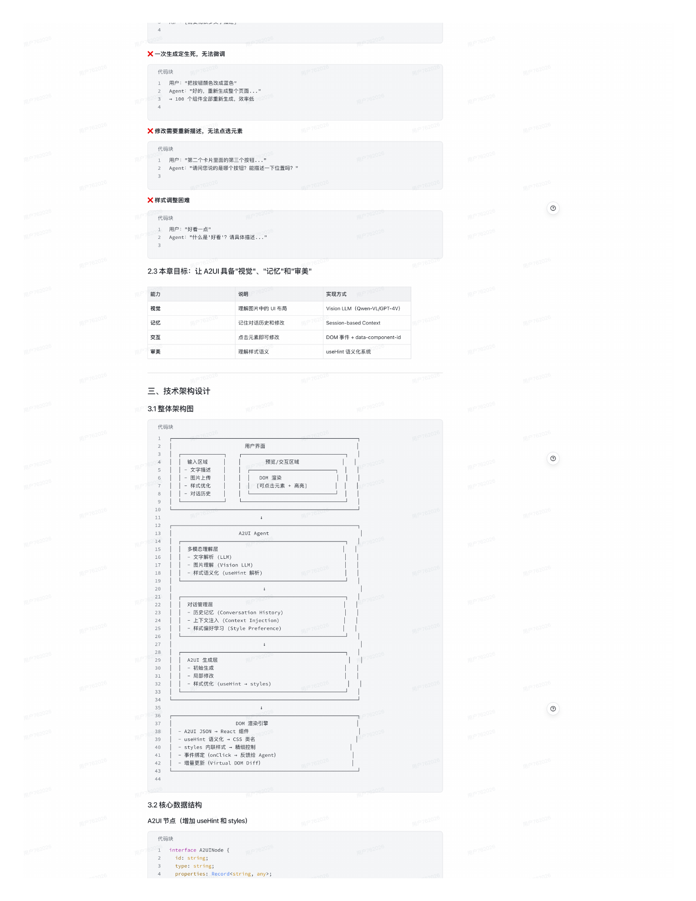
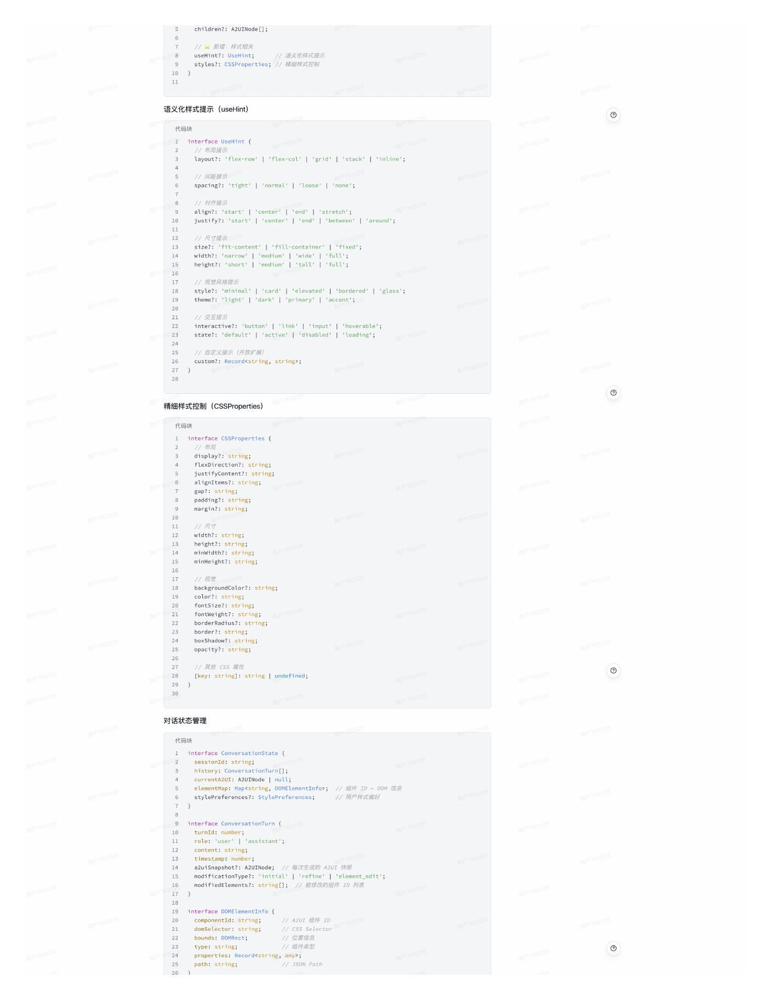
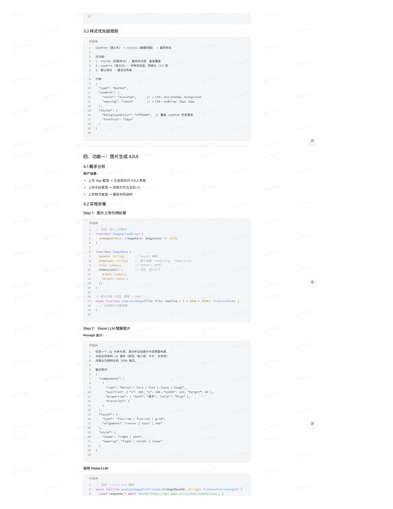
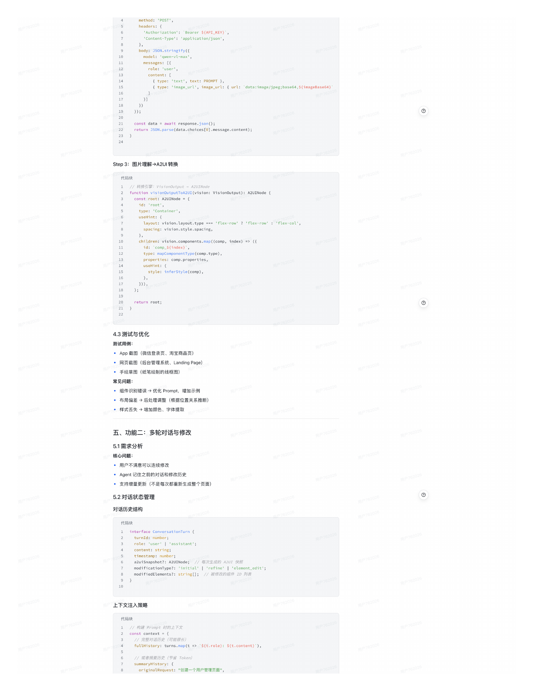
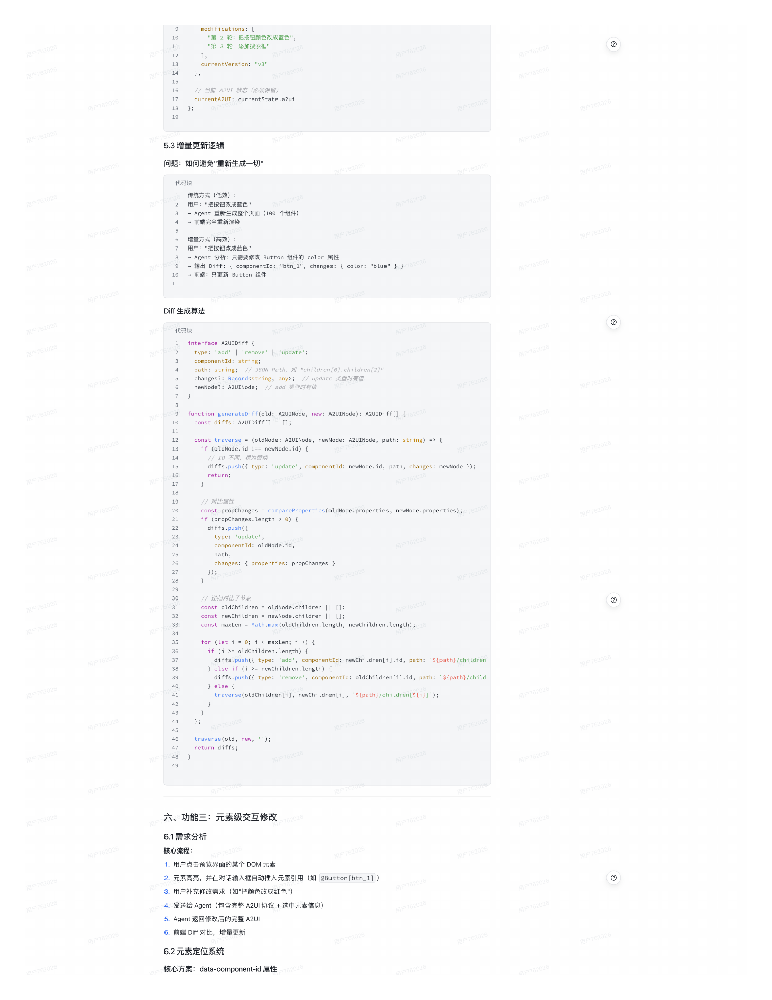
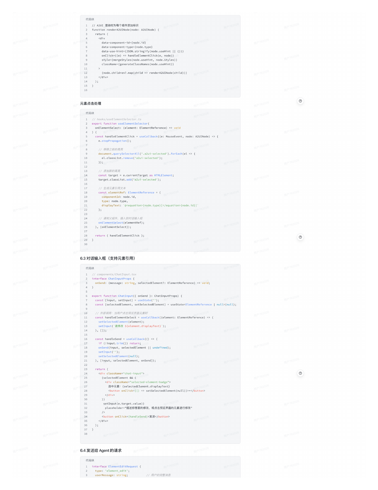
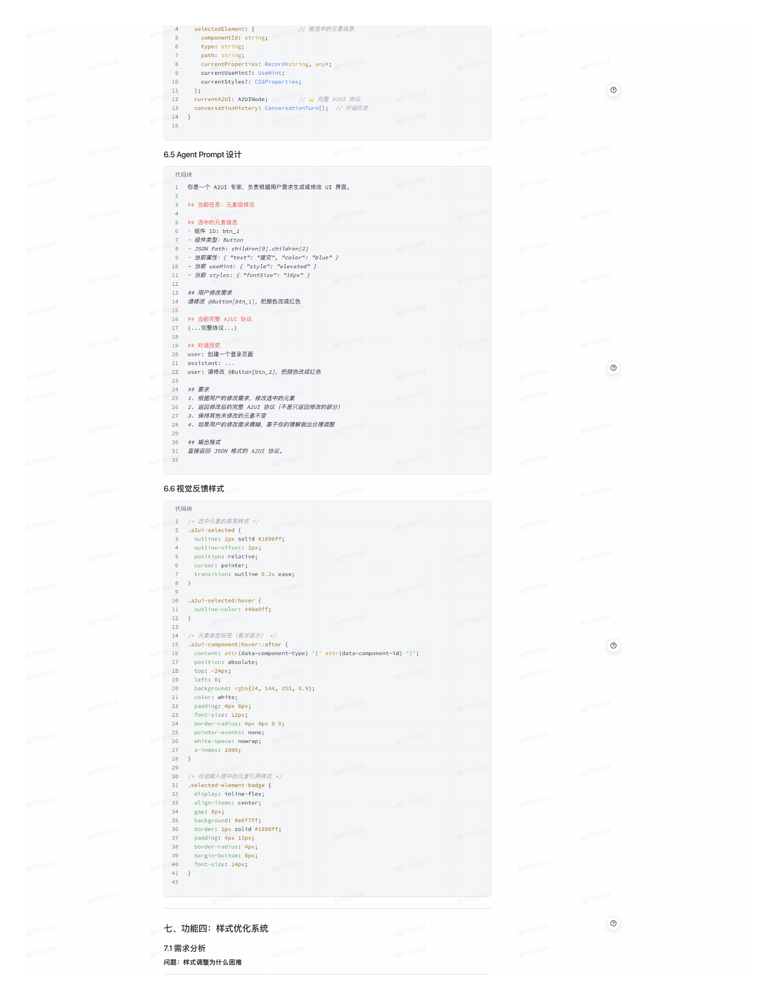
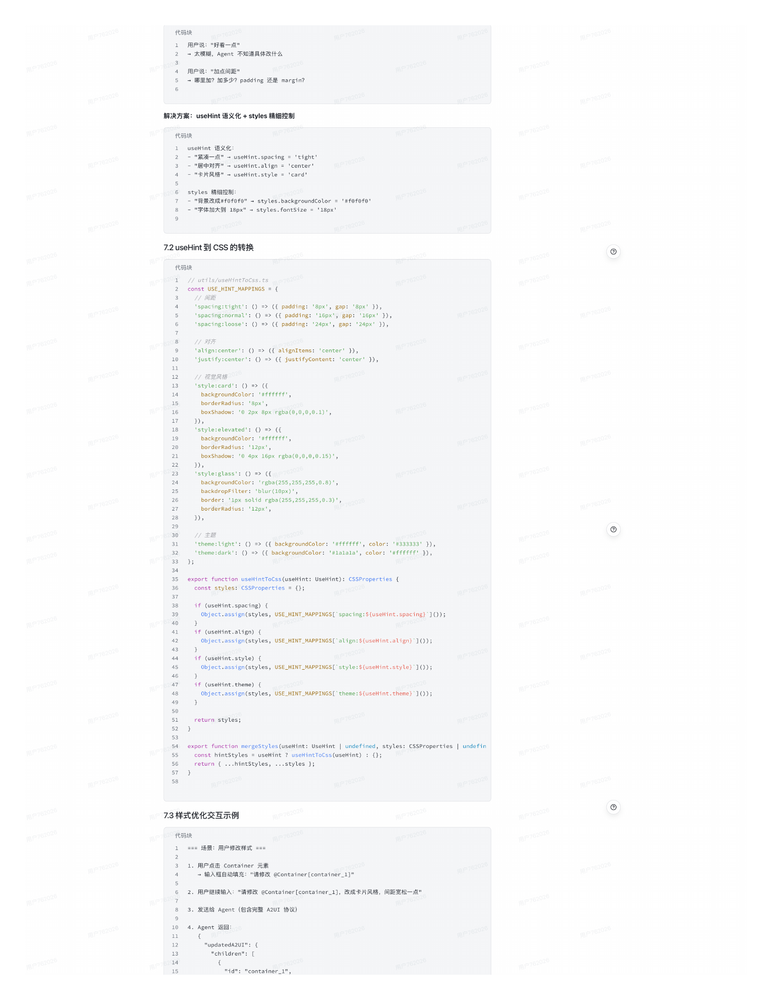
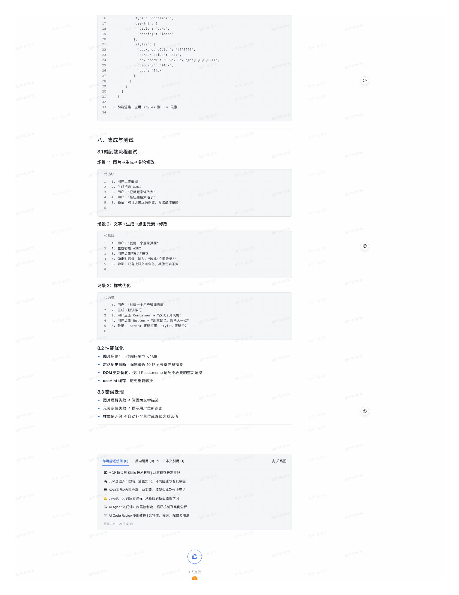

# A2UI 实战（三）- 图片理解与多轮对话

> 来源: `tech3.pdf` | 共 11 页 | 提取: pdftoppm 180DPI + macOS Vision OCR

---

## 第 1 页

a uaaentSa
衿言 >A2UI实战（三）-图片理解与多轮对话 外部 平
俄分享
Q +

A2UI 实战（三）- 图片理解与多轮对话

◎衿言
4月21日修政
AI 速览 试用

本文讨论了 A2UI 实战（三）中图片理解与多轮对话的相关内容，旨在让 A2UI 系统具备“视觉”“记忆”和“审美”能力，介绍…

让 A2UI 系统具备"视党"、"记忆"和"审美"能力

前置知识：已完成 A2UI 实战一（渲染器基础）和实战二（SSE.
AGUI 协议与服务端搭建）

板书

目 A2UI 实战5

前置知识：已完成 A2UI 实战一（渲染器基础）和实战二（SSE、AGUI 协议与服务端搭建）
让 A2UI 系统具备“视觉"、"记忆"和"审美"能力

板书

目 A2UI 实战5

代码：

基于已完成的内容，以及重点优化方向，打造属于自己的a2ui agent！

（如果强烈需要可以和班主任反馈，我再添加进来，不推荐）

001658.tar.gz
a2ui-full-source-20260421-

97.39MB

一、目标

核心目标

通过本章节学习，你将掌握：

• 口图片理解-支持用户上传截图/手绘图，Vision LLM 理解 UI 布局并生成 A2UI

•〔 多轮对话-实现对话状态管理，支持增量修改，避免"重新生成一切”

• ⑧元素级交互-点击 DOM元素 自动插入元素ID 针对性修改

• 样式优化 - useHint 语义化提示 +styles 精细控制，实现样式调优

产出物

本章节完成后，你将拥有：

• a2ui-playground-v3 - 支持图片上传、多轮对话、元素级交互的完整前端

• azui-server-v3 -支持多模态输入、对话状态管理的服务端

• useHint-to-css -语义化样式转换工具库

• 完整的元素级交互实现（点击 引用 修改）

本章在系列中的位置

代码块

实战一：渲染器基础 （Parser、TreeBuilder、Store、React Renderer）

实战二：传输层与服务端（SSE、AGUI 协议、Koa 服务端）

实战三：图片理解与多轮对话一本章

实战四：完整应用集成（端到端联调、性能优化、部署）

二、从静态到动态：A2UI系统的进化

2.1回顾：实战一和实战二完成了什么

实战一（渲染器基础）：

• 囚A2UI JSON Schema 定义

• Parser（解析 A2UI协议）

• 辽 TreeBuilder（枸建组件树）

• Store（状态管理）

• ⑦ React Renderer（DOM 渲染）

实战二（传输层与服务端）：

• 國SSE 流式传输

• 辽 AGUI 协议（传输层约定）

• 辽 Koa 服务端搭建

• Z A2UI Agent 集成（单轮对话）

2.2遗留问题：为什么用户觉得"不够智能"

X只能文字描述，不能直接截图
用户762026

代码块

1 用户：“我想要一个像微信登录页面那样的界面"
Agent："请详细描述您的需求..”
用户：「需西芯很多女字描迷1
用户762026

---

## 第 2 页

X一次生成定生死，无法微调

代码块

用户："把按钮颜色改成蓝色"
Agent："好的，重新生成整个页面⋯.”
- 100 个组件全部重新生成，效率低

×修改需要重新描述，无法点选元素

代码块

用户："第二个卡片里面的第三个按钮..”
Agent："请问您说的是哪个按钮？能描述一下位置吗？“

X样式调整困难

代码块
用尸：好有一泉
Agent："什么是'好看'？请具体描述..”

2.3本章目标：让A2UI 具备"视 、"记忆"和"审美"

能力
说明
实现方式

视觉
理解图片中的 UI 布局
Vision LLM （Qwen-VL/GPT-4V）

记忆
记住对话历史和修改
2eS3/00-0aseo Coneex

交互
点击元素即可修改
DOM 事件+ data-component-id

审美
理解样式语义
useHint 语义化系统

三、技术架构设计

3.1整体架构图

代码块

用户界面

- 文字描述
输入区域
预览/交互区域

- 图片上传
日只古元系＋商元
DOM 渲染

- 对话历史

A2U1 Agent

16
- 文字解析（LLM）
多模态理解层

- 样式语义化（useHint 解析）
图片理解（Vision LLM）

20

22
对话管理层

- -下文注（Context Iniection）
- 历史记忆（Conversation History）

- #吃（Stvle

A2UI 生成层

- 局部修改
- 初始生成

样式优化 （useHint - styles）

- A2UI JSON • React 维件
DOM 渲染引紧

- styles 内联样式 -精细控制
- useHint 沿y化 - CSS 英名

- 培量更新 （Virtual DOM Diff）
- 事件绑定 （onclick • 反馈给 Agent）

3.2核心数据结构

A2UI 节点（增加 useHint 和 styles）

代码块

interface A2UINode｛
id: string；
type:string；

---

## 第 3 页

chiwaren：： Azwiwode，

useHint？： UseHint；
// 新增：祥式相关

styles？：CSSProperties; // 精细样式控制
// 语义化样式提示

语义化样式提示
（useHint）

代码块

interface UseHint ｛

Wavout？： flex-row
// 布局提示
| 'flex-col，
grid'| stack| inline；

spacing？： tignt
// 间距提示
Inone，
用户762026

align？：'startl| "center，| "end、l
// 对齐提示

justify？：'start'| 'center'| 'end'|
'stretch'；
Detween arouno，

size？：'fit-content'| 'fill-container'| 'fixed'；
// 尺寸提示

height？：'short'I'medium'I'tall'|'full'；
width？：'narrow'|
'fuLL'；

18
style？：'minimal，|'card'| 'elevated，| 'bordered'I 'glass'；
// 视觉风格提示

theme？：'Light'|'dark'| 'primary'|
'accent'；

21
// 交互提示
用户762026

2223
state？：'default' | activet 1'rdisabled" | •Loading'；
interactive？：'button'|'Link'| 'input'I 'hoverable'；

// 自定义提示（开放炉展）

精细样式控制
（CSSProperties）

代码块

display？：string；
命局

Tcexuirectlont: suring：
justifyContent？： string；

gap？：string；
alignItems？： string；

margin？： string；
padding？： string；

minvidth？： string；
height？： string；
width？： string；
// 尺寸

minHeight？： string；

cocori. seng：

21
fontSize？：string；
Toncwelgnc: suning；

Doroer. suhing，
porgerkadtus.. 561ng，

opacity？：string；
boxshadow：： string；

［key: string］：string I undefined；
1/ 其他CSS 屬性

25 27 282930
用户762026

对话状态管理

代码块

interface Conversationstate d
sessionId: string；

currentA2UI: A2UINode | null；
history: ConversationTurn［］；

stylepreferences？： StylePreferences；
elementMap: Mapsstring,DOMElementInfo>； // 組件 TD - 00M 信息
丈/ 用户样式偏好

interface ConversationTurn/

role： 'user'| 'assistant'；
turnId: number；

concenc. Suhing，
Tames ama-umoems
// 每次生成的 AZUT 快照

16
modifiedElements？： string［］；
modificationType？：'initial'|'refine' | 'element_edit'；
/ 被修政的组件 ID 列表

18
interface DOMElementInfo ｛

domSelector: string；
componentId:string；
// css setector RP7520
// A2UI 組件 10

2：
22
type:string；
bounds: DOMRect；
// 位置信息

24
// 組件类型

25
26
// JSON Path

---

## 第 4 页

3.3样式优先级规则

代码块

useHint（语义化）+ styles（精细控制）=最终样式

1. styles（内联样式）-最高优先级，直接覆盖
优先级：

2.useHint（语义化）-中等优先级，转换为 CSS 类
默认样式 -最低优先级

tYpe: Button，
"useHint"：｛

13
''spacing"： "loose"
"'style"： "elevated"，
11 -CSS: box-shadow, background
1/ - CSS: padding: 16px 32px

16
15
"'styles"：｛

"fontSize"： "18px"
"backgroundColor"： "#ff00co"，
// 覆盖 useHint 的背景色

27 1829

四、功能一：图片生成 A2UI

4.1需求分析

用户场景：

• 上传 App 截图 生成类似的 A2UI 界面

• 上传手绘草图 转换为可交互的 UI

• 上传网页截图 ＞提取布局结构

4.2实现步骤

Step 1：图片上传与预处理

代码块

interface ImageUploadProps ｛
前端：图片上传組件

onImageSelect：（imageData: ImageData） => void；
用户762026

interface ImageData ｛
base64: string；
// 图片类型（image/png, image/jpeg）
// Base64 編码

Se. numoem
mimeType: string；

// 可选：图片尺寸
// 文件大小（字节）

async tunction compressumage（tlLe: File, maxsize =5* 1024 * 1024）：PromsesBLobx

用尸762021

Step 2:Vision LLM 理解图片

Prompt 设计：

代码块

识别出所有的UI 组件（按钮、输入框、卡片、文本等），
你是一个 UI 分析专家。
请分析这张图片中的界面布局

并输出为结构化的 JSON 格式。

输出格式：

"components"：［

"type"："Button | Card | Text | Input | Image"，

"properties"：｛ "text"： "提交"，
position:tx: 1o0,y:200，"wath: 120，
"color"："blue" ），
height: 40 5g

"hierarchy"： 1

"'Layout"：｛

"alignment"： "center | start I end"
"type"："flex-row | flex-col | grid"，

｝，
"style"：｛

"spacing"： "tight | normal | loose"
"theme"："Light I dark"，

调用 Vision LLM：

代码块

async function analyzeImageWithVisionLLM（imageBase64: string）：PromisesvisionOutput>｛
// 后端：VisionLLM 调用

const response = await fetch（'https://api.qwen.ai/v1/chat/completions'，｛

---

## 第 5 页

headers：｛
method：'PoST'，

'Authorization'：“Bearer $｛API_KEY｝，
'Content-Type'：'application/json'，

body: JSON.stringify（｛
modet. wenwmax，
用户762021

conrenm.
｛ type：'text'，text: PROMPT ｝，
｛ type：'image_url'，image_url： ｛ url:data:image/jpeg;base64,s｛imageBase64｝'

20
J）；

21
22
return JsON.parse（data.choices［o］.message.content）；
await response.json（）；

Step 3：
图片理解 A2UI转换

代码块

function visionoutputToA2UI（vision: Visionoutput）： A2UINode ｛
const root: A2UINode =｛

type：'Container'，
10: root，

useHint：｛

spacing: vision.style.spacing，
layout:vision.Layout.type === 'flex-row'？'flex-row'：'flex-col'，

children: vision.components.map（（comp,index）=>（｛
id：
Cype: mapcomponent ype Vcomp.Cype，：
comp_$｛index｝，
用户762026

Stywe. Therotywetcomp，

rerurn room：

4.3测试与优化

测试用例：

• App截图（微信登录页、淘宝商品页）

• 网页截图（后台管理系统、Landing Page）

• 手绘草图（纸笔绘制的线框图）

常见问题：

• 组件识别错误 优化 Prompt，增加示例

• 布局偏差 后处理调整（根据位置关系推断）

• 样式丢失 增加颜色、字体提取

五、功能二：多轮对话与修改

5.1需求分析

核心问题：

• 用户不满意可以连续修改

• Agent 记住之前的对话和修改历史

• 支持增量更新（不是每次都重新生成整个页面）

5.2对话状态管理

对话历史结构
用户762026

代码块
intertace conversationlurn

role：'user' assistant：

modificationType？：'initial'| 'refine'| 'element_edit'；
akulshassnot. Aauznoue
// 每次生成的 AZUI 供照

modtTledtcemencs.： schinglJ，
// 被修改的组件 ID 列表

上下文注入策略

代码块
//构樂 Promot 如的上下贝

fullHistory: turns.map（t => cs｛t.role｝： $｛t.content｝'），
// 完整对话历史（可能很长）

summaryHistory：｛
//或音摘要 （ 有 1oKen，

originalRequest："创建一个用户管理页面"，

---

## 第 6 页

11
男么牝•把技世感巴成成盤巴，

currentVersion： "v3"

15
16
// 当前 A2UI 状态（必须保留）

18
currentA2UI：
currentState.azui

19
｝；

5.3 增量更新逻辑

问题：如何避免"重新生成一切"

用户：“把按钮改成蓝色"
传统方式（低效）：

• 前端完全重新渲染
- Agent 重新生成整个页面（100个组件）

用户："把按钮改成蓝色"
增量方式（高效）：

- 输出 Diff： ｛ componentId: wbtn_i"， changes： ｛ color： "blue" ｝ ｝762021
- Agent 分析：只需要修改 Button 组件的 color 届性

-前端：只更新 Button 组件

Diff 生成算法

代码块

interface A2UIDiff ｛
type：'add'| 'remove'| 'update'；

path: string；
componentId: string；

changes？：Record&string, any>；
1/ JSON Path，如 "children［@｝.children［2］"

// add 类型时有值
// update 类型时有值

function generateDiff（old: A2UINode, new: A2UINode）：A2UIDiff［］d
const diffs: AZUIDiff［］ = ［］；

consL craverse - （olaNode: Azw_Node, newNode: Hzuznoce, paun: suing）-t
7ocro0e.10 =- newoce1

17
return；
diffs.push（｛ type：'update'，componentId: newNode.id, path, changes: newNode ］）；

21
const propChanges = compareProperties（oldNode.properties, newNode.properties）；762025
if （propChanges. length >◎） ｛
diffs.push（f

componentId: oldNode.id，
type：'update'，

3）；
changes： ｛ properties: propChanges ｝

const ouoch toren - owoNooe.ohtcaren LJs
// 递归对比子节点

const makten - Nath.nax（owocnworen.uengh, newcnvoren. vengd）.2
const newChildren = newNode.children I| ［］；

for （let i = 0; i s maxlen; i++）
if （i >= oldChildren.Length）｛

｝ else if （i >= newChildren.length）｛
diffs.push（｛ type：'add'， componentId: newChildren［i］.id, path：
‘$｛path｝/children

｝ else ｛
diffs.push（｛ type：'remove'，componentId:oldChildren［i］.id, path：‘s｛path｝/child

traverse（oldChildren［i］，newchildren［i］，
's｛path｝/children［s｛i｝］'）；

return difts：
traverse（oLd. new.

六、功能三：元素级交互修改

6.1需求分析

核心流程：

1. 用户点击预览界面的某个 DOM 元素

2.元素高亮，并在对话输入框自动插入元素引用（如 eButton［btn_1］）

3. 用户补充修改需求（如"把颜色改成红色"）

4. 发送给 Agent（包含完整 A2UI 协议＋选中元素信息）

5. Agent 返回修改后的完整 A2UI

6. 前端 Diff 对比，增量更新

6.2元素定位系统

核心方案：data-component-id 属性

---

## 第 7 页

代码块

TuneonrenaeA.u.Nodeinode A.ooe：
// A2UT 渲染时为每个组件添加标识

recunn

data-component-id=｛node.id｝

data-use-hint=｛sON.stringify （node.useHint II C｝）｝
data-component-type=｛node.type｝

style=｛mergestyles （node.useHint, node.styles）｝
onClick=｛（e） => handleElementClick（e, node）｝

className=｛generateClassames（node.useHint）｝

｛node.children？.map（child => renderA2UINode（chi ld））］

元素点击处埋

代码块

onELementSeleet：（element: ElementReference） => void

const hancLeELementcick = usecallbacktfe: MouseEvent. node: A2UINode） =〉||

document.querySelectorAll（'.a2ui-selected'）.forEach（el => ｛
// 移除之前的高亮

｝）；
el.classL1st.remove（ azul-se.ected）；

const target = e.currentTarget as HTMLELement；
target.classList.add（'a2u1-selected'）；

const elementRef: ElementReference = ｛
// 生成元素引用文本

componentId: node.id，

displayText：'@sequation>｛node.type｝ ［s/equation>｛node.id｝］'
type:node.type，

onElementSelect（elementRef）；
//通知父组件，插入到对话输入框

」，Lont LementsececLJy，

29

6.3对话输入框（支持元素引用）

代码块

interface ChatInputProps｛
components/Chatlhput.ts；

onSend：
selectedElement？： ElementReference） => void；

export function ChatInput（ onSend：： ChatInputProps）之

const ［selectedElement, setSe LectedELement］ = useState<ElementReference| nuLL>（nuLL）；
constTinput. setlnputi = usestate：

const handleElementSelect = usecallback element: FlementReference） = ！
// 外部调用：当用户点击预览界面元素时

seLoeuecuedt Lemenu（ecemenL），

｝，口）；
setInputC请修改 S｛element.displayText｝）；

const handleSend = useCallback（（）
if （！input.trim（））return；
=>-

onSend（input, selectedElement |l undefined）；

setSelectedElement（nuLL）；
setInput（''）；

），［input,selectedElement，
onSend］）；

｛selectedElement && （

<button onclick=｛（） => setSelectedElement （nulL）｝>x</button>
选中元素：｛selectedElement.displayText｝

placeholder="描述你想要的修改，
或点击预览界面的元素进行修改"

33
<button onClick=｛handleSend｝>发送</button>

）；

6.4发送给 Agent的请求

代码块

interface ElementEditRequest ｛
type：
userMessage: string；
'element_edit'；
用户762026

/ 用户的完整消息

---

## 第 8 页

selectedElement：｛
componentId: string；
）7// 被选中的元素信息

path:string；
type: string；

currentProperties: Recordsstring, any2；兩P76202
currentUseHint？： useHint；
用户762026

currentStyles？： CSSProperties；

currentA2UI:A2UINode；
conversationHistory: ConversationTurn［］；// 对语历史
// 完整 A2UI 协议

6.5 Agent Prompt设计

代码块

你是一个 A2UI 专家，负资根据用户需求生成或修改 UI 界面。

## 当前任务：元素级修改

组件 ID:btn_2
选中的元素信息

- JSON Path:children［0J.children［2J
-組件类型：Button

- 当前 useHint：〔 "'style"：
当前屬性：｛"text"："提交"，
"elevated" ｝
"color"： "blue" ｝

当前 styles:f
"fontSize"： "16px" ｝

## 用户修改需求

15
诗修改 @Button［btn_1］，
把颜色改成红色

17
## 当前完整 A2UI 协议
.•.完整协议.•.｝

19
user：创建一个登录页面
## 对话历史

user：请修改 @Button［btn_2J，把颇色改成红色

25
24

26
街婚居广的修文器水，悠以越早的开系

27
返回修改后的完整 A2UI 协议（不是只返回修改的部分）

28
保持其他未修改的元素不变
如果用户的修改需求模糊，基于你的理解做出合理调整

31
#料 输出格式
直接返回 JSON 格式的 A2UT 协议。

6.6视觉反馈样式

代码块

/* 选中元素的高亮样式*/

pos1tion:are lative：
outcine-ottset: 2px；

cursor:pointer；
transition: outline 0.2s ease；

.a2ui-selected:hover ｛
out Line-co Lor： #40a9tt；

13

15
14
/* 元素类型标签（悬浮显示）

17
16
.a2ui-component:hover：：after ｛
content: attr（data-component-type）'［'attr（data-component-id）"］'；

18
top：-24px；
v€Tc•C，
Dackgrouno.g0al24, 144，

padding: 4px 8px；
font-size: 12px；

25
pointer-events: none；
border-radlus: 4px 4px 60；

white-space: nowrap；
Z-index: 1000；

/* 对话输入框中的元素引用样式*/

32
.selected-element-badge ｛
display: inline-flex；

34
align-items:center；

35
36
background： #e6f7ff；

37
padding: 4px 12px；
border: 1px solid #1890ff；

poruer=ladlus 4ox：

七、功能四：样式优化系统

7.1需求分析

问题：样式调整为什么困难

---

## 第 9 页

代码块

- 太模糊，Agent 不知道具体改什么
用户说："好看一点”

用户说："加点间距"
-哪里加？加多少？padding 还是 margin？

解决方案：useHint 语义化 + styles 精细控制

代码块

- "居中对齐"-useHint.align = 'center'
- "紧凑一点"- useHint.spacing = 'tight'

- "卡片风格"-useHint.style = 'card'

styles 稍细控制：

- "字体加大到 18px"-styles.fontsize = '18px'
- "背景改成#fof@f@"- styles.backgroundColor ='#fofofo、

7.2 useHint到CSS 的转换

代码块
用户762026

const USE_HINT_MAPPINGS = ｛
用户762026

'spacing:tight'：（） => （｛ padding：'8px'， gap：'8px'｝），
'spacing:normal'： （） => （｛ padding：'16px'； gap：
'spacing:loose'： （） => （｛ padding：'24px'， gap：'24px'｝），
'16px'｝），

// 对芳

'justify:center'：
'align:center'： （）=> （｛ alignItems：'center’｝），
（） => （｛ justifyContent： 'center'｝），

13
// 視 反格
'style:card'： （）=>（｛

borderRadius：'apx'，
backgroundColor：'#ffffff'，

J），
'◎ 2px 8px rgba（0,0,0,0.1）'，

'style:elevated"：（）=> （｛
backgroundColor：'#ffffff'，
borderRadius：'12px，

J），
boxShadow：'0 4px 16px 「Bba（0,0,0,9.15）'，

'style:glass'： （） => （｛

backdropFilter：'blur（10px）'，
backBroundColor：'rgba（255,255,255,0.⑧）'，

borderRadius：'12px'，
borderi c'Ipx solid rgba（255,255,255,0.3）"，162028

｝），

31
30
'theme:Light'：（）=>（｛ backgroundColor：'#ffffff'，color：'#333333'｝），
// 主题

'theme:dark'：（） =>（｛ backgroundColor： '#Lalala'，color： '#ffffff！ ｝），

34
export function useHintToCss（useHint: UseHint）： CSSProperties ｛
const styles: CSSProperties = ｛｝；

if （useHint,spacing）
object.assign（styles, USE_HINT_MAPPINGS［'spacing：$｛useHint.spacing｝ ］0））；

object.assign（styles, USE_HINT_MAPPINGS［'align：$fuseHint.align｝'］（））；

if （useHint.style）｛
Object.assign（styles, USE_HINT_MAPPINGS［'style：$fuseHint.style｝"］0））；

if（useHint.theme）｛
Object.assign（styles, USE_HINT_MAPPINGS［'theme：$｛useHint.theme｝'］（））；

52

export function mergestyles（useHint: UseHint | undefined, styles: CSSProperties | undefin
const hintStyles = useHint ? useHintToCss（useHint）：｛｝；

57

7.3样式优化交互示例

代码块

=== 场景：用户修改样式 ===

1.用户点击 Container 元素
• 输入框自动填充："请修改 @Container ［container_1］"

用户继续输入："请修改 @Container［container_2］，改成卡片风格，间距宽松一点"

Agent

'updatedA2UI"：｛
用户762026

"children"： ［

"id”："container_1"，

---

## 第 10 页

16
"type"："container"，

18
"useHint"：｛

19
"'styLe"： "card"，

20
"'spacing"："loose"

21
｝，

23
22
'StyLes:L

"backgroundColorm："#ffffff"，

24
"borderRadius"： "8px"，

25
"boxShadow"： "@ 2px 8px rgba（0, 0,0,0.1）"，

26
_"padding"： "24px"，

27
"gap"： "24px"

用户762026

用户762026

前端渲染：应用 styles 到 DOM 元素

用户762026

八、集成与测试

8.1端到端流程测试

场景1：图片 生成 多轮修改

代码块
1. 用户上传截图
用户762026

4.用户："按钮颜色太暗了"
3．用户："把标题字体改大"

5.验证：对话历史正确保留，修改是增量的

场景2：文字 生成 点击元素 修改

代码块

2. 生成初始 A2UI
1．用户："创建一个登录页面"

3. 用户点击"登录"按钮

5.验证：只有按钮文字变化，其他元素不变
4.弹出对话框，输入：”改成'立即登录"

场景3：样式优化

代码块

1.用户："创建一个用户管理页面"

3.用户点击 Container -"改成卡片风格"
2.生成（默认样式）

4. 用户点击 Button -"用主题色，圆角大一点”
验证：useHint 正确应用，styles 正确合并

8.2 性能优化

• 图片压缩：上传前压缩到＜1MB

• 对话历史截断：保留最近 10轮＋关键信息摘要

• DOM 更新优化：使用 React.memo 避免不必要的重新渲染

• useHint 缓存：避免重复转换

8.3 错误处理

• 图片理解失败 降级为文字描述

• 元素定位失败 ＞提示用户重新点击

• 祥式值无效 -自动补全单位或降级为默认值

你可能还想问（6）
反向引用（0）②
本文引用（1）
品关系图

籌 MCP 协议与 Skills技术教程|从原理到开发实践

4LLM基础入门教程|涵盖知识、环境搭建与普及原因

号 A2UI实战2内容分享-UI实现、框架构成及作业要求

& JavaScript 训练营课程 |从基础到核心原理学习

Q Al Agent 入门课：底层控制流、循环机制及案例分析

囚 Al Code Review使用教程|含特性、安装、配置及用法

推荐内容由 Al生成 ◎

C

1人点赞

---

## 第 11 页

_（本页 OCR 未识别到文本）_

---
