# 四、生成式 UI 与 A2UI

> 来源: `tech4.pdf` | 共 22 页 | 提取: pdftoppm 180DPI + macOS Vision OCR

---

## 第 1 页

a uaaentSa
衿言 ›四、生成式 U1 与 A2UI外部平
俄分享
Q +

四、生成式 UI 与 A2UI

◎衿言
3月15日修改
今 AI速览 诚用

1.1什么是生成式 UI

编码的固定界面。
生成式 UI（Generative UI）是指由AI根据任务、上下文和用户意图，动态生成的用户界面，而不是预先设计和

传统 UI vs 生成式UI

传统 UI：

代码块

1 设计师设计 -工程师编码 -测试-上线-用户交互

• 所有界面预先设计和编码
特点：

• 修改需要重新开发
• 只能支持已规划的场景

• 开发周期长（天/周）

生成式 UI：

代码块

用户任务 •AI 分析 •动态生成界面-用户交互

• 界面根据任务实时生成
特点：

• 支持无限场景

• 生成速度快（秒级）
• 用完即弃，按需生成

1.2为什么需要生成式UI

传统 UI 的局限

问题
说明
示例

场景覆盖有限
只能支持预先设计的场景
无法处理未预料的查询

开发成本高
每个界面都要设计＋编码
新功能霈要迭代周期

信息密度固定
无法根据任务调鉴
简单查询也显示复杂界面

上下文罰裂
UI 与对话分离
聊天是聊天，界面是界面

生成式 UI 的价值

代码块

根据任务动态调整界面复杂度

复杂任务 - 丰富界面
简单任务-简单界面

囚 愛开发成本

无需设计师参与
AI 直接生成，无需工程师编码

11
上下文融合

12
界面是对话的自然延伸
UI 与对话无缝衔接

14
辽 无限场景
支持任何可描述的任务

17
不受预先设计限制

1.3典型应用场景

场景1：数据查询与可视化

用户："对比一下 Q1和Q2的销售数据"

生成式 UI：

代码块

Q1 vs Q2 销售对比

Q1：¥80M

增长率：+25%
用户762026

用户762026

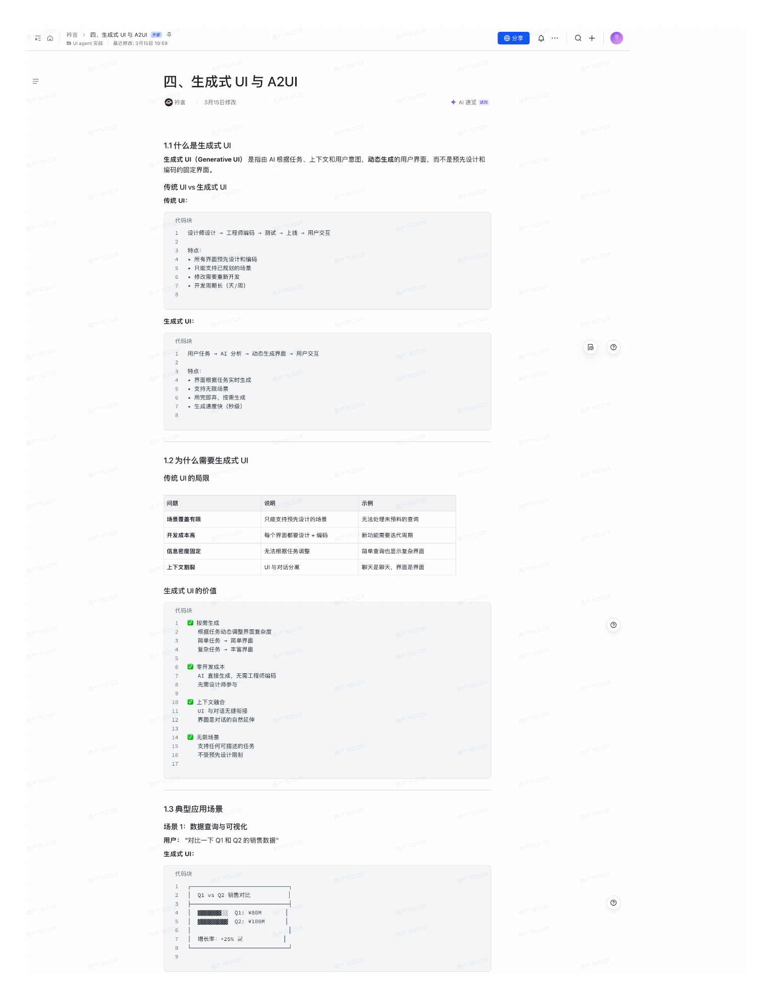

---

## 第 2 页

传统方案：需要预先设计报表页面 开发周期3-5天

生成式 UI：即时生成 秒级响应

场景 2：表单与配置

用户："帮我创建一个新任务"

生成式 UI：

创建任务

5D
负责人：［选择人员v］
标题：［_-

优先级：低 o中 o高
哉止：［微 选择日期］

10
［取消］
［确认创建］

传统方案：需要设计表单页面＋后端 API 开发周期1-2周

生成式 UI： 即时生成 —秒级响应

场景 3：复杂信息展示
用户76202|

用户：“分析这个代码库的结构”

生成式 UI：

代码块

代码库结构分析

口 src/（45 文件）
F 口 components/ （12）

L 曰 utils/ （5）
口 hooks/ （8）

TypeScript: 65%6
n 代码统汁：

12
JSON:15%
CSS: 20%

传统方案：需要设计 Dashboard 开发周期2-3周

生成式 UI： 即时生成 秒级响应

场景 4：交互式工作流

用户：“帮我预订会议室"

生成式 UI（多步骤交互）：

代码块

步骤 1：选择会议室

可用会议室

◎ 会议室 A（10人）

0 会议室C（5人）
• 会议室 B（20人）

［下一步］

步骤 2：选择时间

选择会议时间

17
-2026-03-12
14:00 - 15:90

20
［上一步］620［确认预订］

传统方案：需要设计完整预订流程 开发周期2-4周

生成式 UI：即时生成 秒级响应

1.4生成式UI 技术方案

方案1：HTML/CSS/JS生成

原理：Al 生成标准 HTML/CSSJJS代码，在Webview 中渲染。

优点：

• ⑦支持复杂交互和动画
•乙技术成熟，生态完善

• ⑦可复用现有前端组件库

缺点：

• X安全性风险（XSS、代码注入）

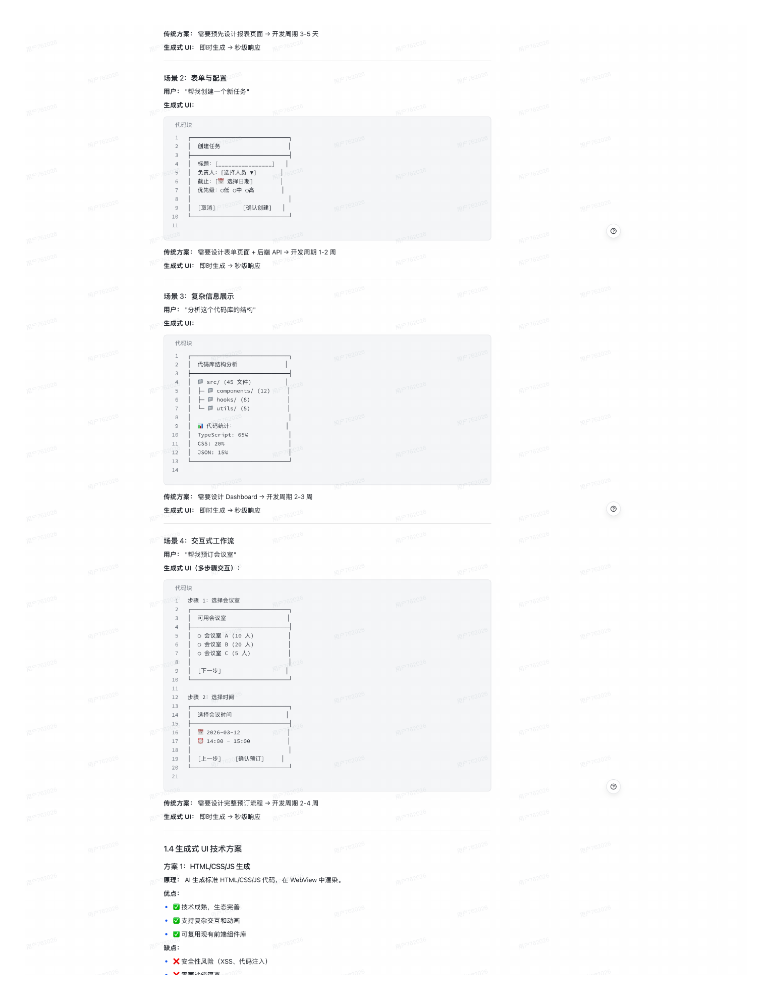

---

## 第 3 页

* 而女 相阿凶

• X样式可能不一致

•×难以保证可访问性

代表产品：Vercel vO、Claude Artifacts

方案 2：组件树 JSON

原理：AI 输出结构化的组件树JSON，由渲染器解析渲染。
优点：
用户762026

•囚结构清晰，易于验证

• 辽无代码执行风险
用户762026

• 辽样式统一可控

缺点：

• ×表达能力受限于预定义组件

•X复杂布局难以描述

•×需要客户端实现所有组件

代表技术：React Server Components、Flutter UI JSON
週户762026

方案3：声明式 UI DSL

原理：AI使用专用 DSL（领域特定语言）描述界面。

优点：

• 刁语法简洁，token 效率高
用户762021

• 囚强类型，易于校验

•辽可编译为多种目标平台

缺点：

• X需要学习 DSL 语法

• ×生态工具少

• ×灵活性受限

代表技术：Jetpack Compose、SwiftUI 声明式语法

方案 4:A2UI（Agent-to-User Interface）

原理：专为 Agent设计的UI 协议，基于JSONL 传输组件树。

优点：

• ⑦专为 Agent 场景设计

• ⑦流式传输，支持增量更新

•⑦平台无关，跨端一致

• ⑦安全性高（无代码执行）

缺点：

• X需要客户端实现渲染器
•X协议较新，生态待完善

代表：OpenClaw A2UI

1.5方案 比总结

方案
安全性
灵活性
开发成本
适用场景

HTML/CSSIJS
XX
低
开放场景、复杂交互

组件树 JSON
日
企业应用、固定组件

声明式 DSL
KXX
高
原生应用、高性能
◎

A2UI
Agent对话、动态

选择建议

代码块

绵要快速原型/开放场景

选择 HTML/CSS/JS（Vercel v8 等）

企业应用/需要安全可控

选择 组件树 JSON 或 AZUI

原生应用/高性能要求

Agent 对话场景

16
选择 A2UI（专为 Agent 设计）

1.6生成式UI 的挑战

技术挑战

挑战
说明
解决方案

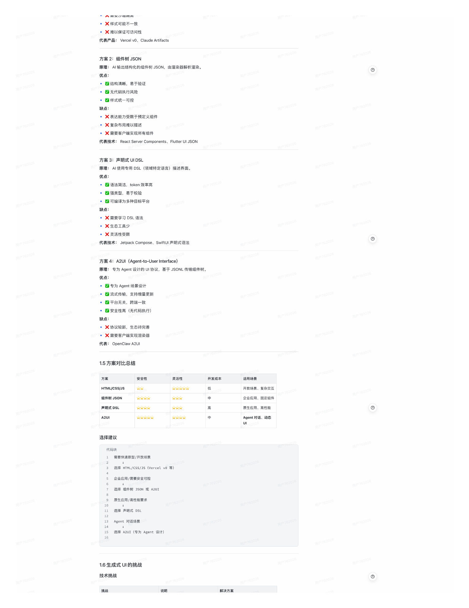

---

## 第 4 页

一致性
生成的 UI 风格可能不统一
设计系统＋主题约束

可访问性
可能忽略无障碍需求
强制 Atly 检查

性能
复杂 UI 生成慢
流式传输＋增量渲染

安全性
代码注入风险
沙箱隔离＋无代码方案

体验挑战

挑战
说明
解决方案

用户预期
用户不习惯动态 UI
渐进式引入＋引导

交互连贯
界面切换可能突兀
半消込没列色

状态管理
多步骤交互状态复杂
统一状态管理协议

第2章：A2UI 协议详解

“A2UI的本质：让 AI 动态生成 UI描述，通过协议传输到客户端渲染。“

2.1从 React到 A2UI

React 的核心思想

UI = f（state）

- 声明式：你定义状态，React 负责渲染
- state 变化 - UI 自动更新
用户762026

- 单向数据流

React解决的问题：

代码块

传统 jQuery 方式：
state 变化•手动查找 DOM -手动更新•容易出错

React 方式：
state 变化 - React 自动 Diff - 高效更所 DOM

A2UI 的扩展

代码块

A2UI

UI 组件预先编码
state 手动定义
AI（state） AI 理解上下文生成状态 |

f（） = React 渲染
AI（UI）AI 动态生成 UI 描述
FO= 份以+注染器

A2UI 解决的问题：

代码块
传炕力工
粥求 -设计 UI -编码组件-测试-上线（天/周）

A2UI 方式：
任务 - AI 生成 UI 描述-协议传输-渲染（秒）

这是简化类比

A 注意：这个公式是教学类比，不是精确的技术定义。

实际流程更复杂：

代码块
AI 理解 Context

生成 State（数据）+UIDescription（组件树）

A2UI 协议封装（JSONL 格式）

SSE 传输（服务端-客户端）
用户762026

渲染器解析 + 渲染

最终 UI

公式的价值：帮助有 React 背景的人快速建立心智模型。

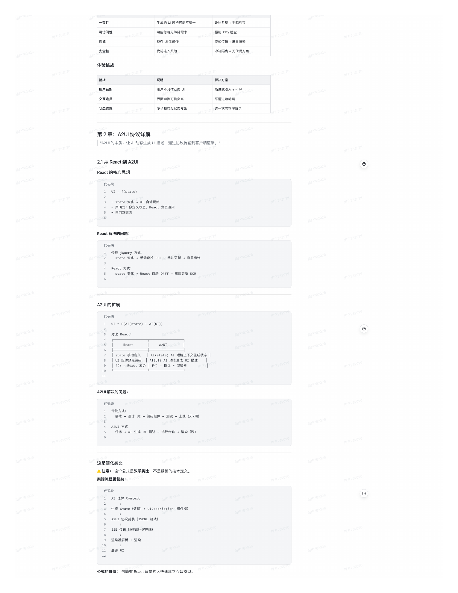

---

## 第 5 页

传输说明：
公式的局限：掩盖了协议层、传输层、Al不确定性等复杂细节。

• A2UI 消息通过 SSE（Server-Sent Events）从服务端推送到客户端

• 客户端通过 A2A 协议发送用户事件到服务端**

• A2UI（应用层）：定义UI组件树、JSONL 消息格式

•AGUI（传输层）：定义 SSE/WebSocket 连接、消息传输：*

代码块

AI 理解 Context

生成 state（数据）+UIDescription（组件树）

A2UI Protocol 封装（JSONL 格式）

传输层 （WebSocket）

渲染器解析 + 渲染

最终 UI

公式的价值：帮助有 React 背景的人快速建立心智模型。

公式的局限：掩盖了协议层、传输层、AI 不确定性等复杂细节。

2.2 A2UI 协议架构

整体架构

代码块

Agent
〔服务端）

Context
AI 理解
构建器
组件树
JSONL
A2UI

SSE（推送 UI）
+ A2A（接收事件）

SSE （Server-Sent Events）

client（客户端）

接收
SSE
解析器
JSONL
+ 渲染器
树构建

27
A2A（发送事件）

重要说明：A2UI vS AG-UI

协议
全称
职责
来源

A2UI
Agent-to-UI
生成式 UI 规范-定义 UI
组件树、JSONL 格式、
Google

Agent 用户交互协议-定
义双向事件流、共享状态

两者关系：AG-UI 支持 A2UI 作为其 Generative UI 规范，但它们是不同的协议。A2UI 使用SSE（服务端推送）+
A2A（客户端事件）进行传输。

Client（客户端）

JSONL |树构建
"| 接收||解析器
一+ 渲染 ||
|I |SSE/WS| I

代码块

层次说明：

• A2UI（应用层）：定义UI组件树结构、JSONL 消息格式、DataModel 状态管理

类比：A2UI:AGUI = HTML: HTTP
• AGUI（传输层）：定义 SSE/WebSocket 连接、握手流程、消息封装与传输

代码块

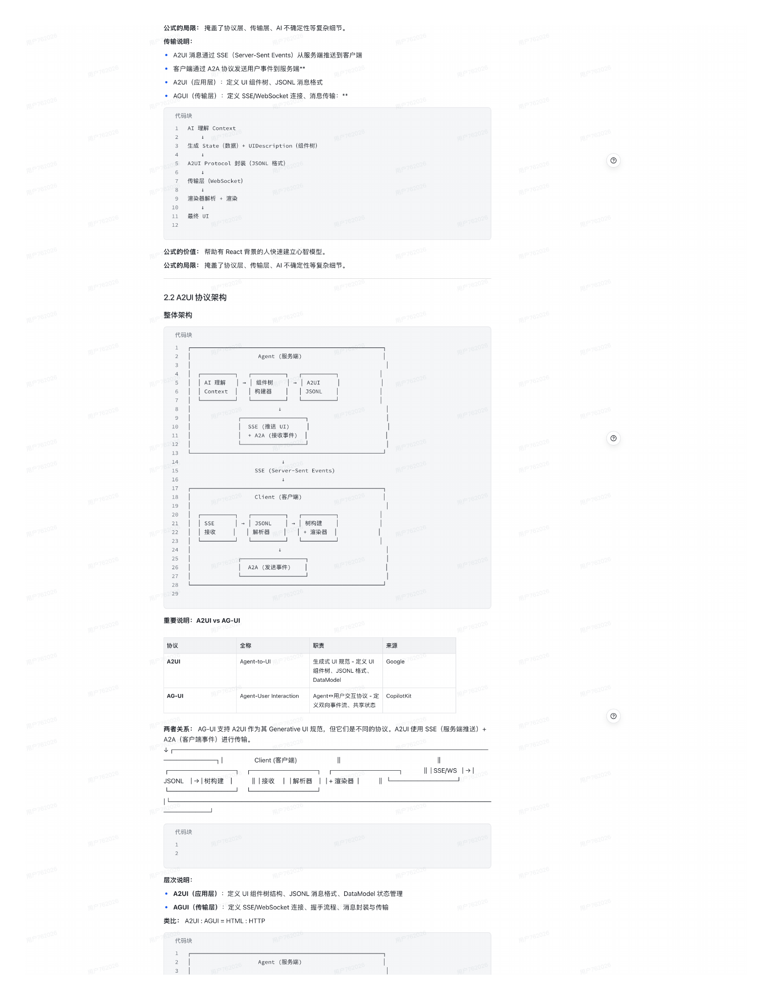

---

## 第 6 页

AI 理解
ConteX
构建器
组件树
序列化

68Lg
AGUI 协议层
（webSocket）

AGUI Protocol

client（客户端）

WebSocket|
接收
解析器
JSONL
+ 渲染器
树构建

核心概念

概念
说明
类比

Surface
UI 画布，
一个独立的 UI 表面
类似 React 的一个"根组件’

Component
等）
UI 組件（Text、
Button、Column
类似 React 組件

DataModel
数据模型，存储 UI 状态
类似 React state

JSONL
传输格式，每行一个 JSON 对象
类似 JSX 的序列化形式

2.3 Surface（UI画布）

什么是 Surface

Surface 是一个独立的 UI表面，可以理解为：

• 一个对话框

• 一个面板

• 一个卡片区域

• 一个独立的 UI 上下文

类比：

代码块

React：
A2U1： -l surtace
一个 <App>根组件

Surface 的生命周期

代码块

2. surfaceUpdate（日次次

3. beginkengen1ng

4. 用户交互/ 数据更新

Surface 消息格式

创建 Surface：

代码块

｛"createSurface"： ｛"surfaceId"："main"，"version"："0.9"3｝

更新 Surface（组件树）：

代码块

｛'surfaceUpdate"：｛"surfaceId"："main"，"components"：［

｛'id"："title"，"component"：｛"Text"：｛'"text"：｛"literalString"："Hello"｝，'usageHint"："h1"｝｝｝
｛"id"'："root"，"component"：｛'"Column"：｛"children"： ｛"explicitList"： ［"title"］｝｝｝｝，

］｝］

开始渲染：

代码块

｛"beginRendering"：｛"surfaceId"："main"， "root"："root"｝｝

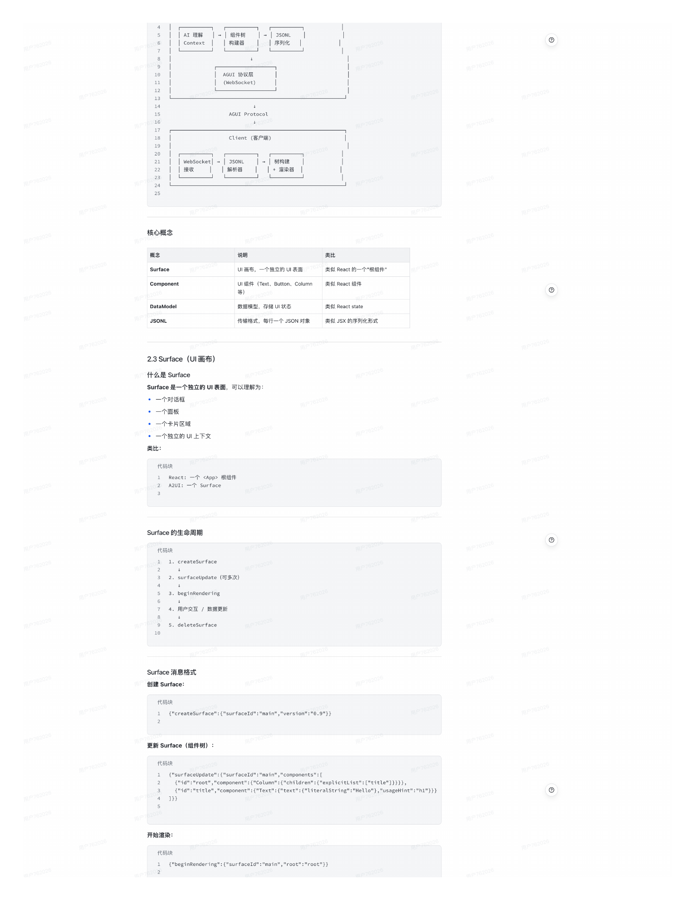

---

## 第 7 页

删除 Surface：

'deletesurtace: surtace_d:mann

多 Surface 管理

场景：同时显示多个 UI

代码玦

北尔 大明，15
Surtace: weather

Surtace: task form

每个 Surface 独立更新：

代码块

''surtacevpdate:surtaceld:task_torm,components:L•..Jj
surtacevpdate: surtace d: weather, components：...

2.4 Component（组件）

组件类型

基础组件：

始心
说明

Text
又本显示
text, usageHint （hi/hz/body）

Lmage
图片品元
source,width, height

BUttOn
按钮
cabel.onrress

Input
擷八花
oncnanee
placeho Lder, value，

布局组件：

俎件
说明
鹿任示份

辛且仂问
chi udren, spacing

KOW
水半中同
chiuaren,alignment

Gr1d
网裕仲局
chl Ldren, coLumns

高级组件：

组件
属性示例

data, chartType （barjline/pie）

-15
1tems, render_tem

title, children, onCLick

组件结构

完整组件定义：

代码块

''component"：｛
id:title，

'Text：
text：
"LiteralString"："销售数悲报告"

"usageHint"： "h1"，
"stvle"：｛

"fontleight"："bold！
"fontSize"： 24，

属性说明：

id：组件唯一标识（用于更新和事件绑定）

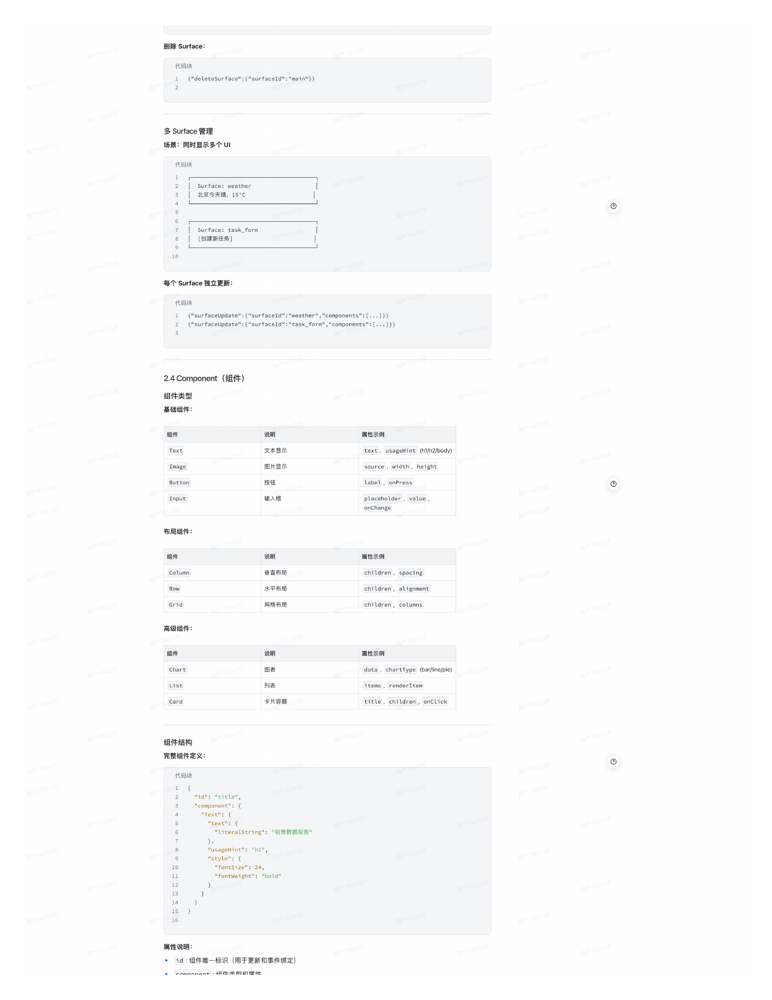

---

## 第 8 页

usageHint）：使用场景提示（h1/h2/body 等，帮助渲染器选择样式）

• style：可选的样式覆盖

组件嵌套

Column 包含多个子组件：

代码块

Mid:r000。
"component"；｛

expLicltList:title，
content, Dutton

"spacing"："medium"

扁平化表示：

代码块

｛"id"："title"， "component"：｛"Text"： ｛"text"：｛"literalString"："标题"｝｝｝｝，
｛'id"："root"，"component"：｛"Column"：｛"children"： ｛explicitList"： ［"title"， "content"

｛'id"："content"，"component"：｛"Text"：｛"text"：｛"LiteralString"："内容"｝｝｝｝，
"component"：｛"Button"：｛"label"： ｛"literalstring"："点击"｝｝｝｝

2.5 DataModel（数据模型）

什么是 DataModel

DataModel 是UI 的状态存储，类似 React 的 state。

用途：

• 存储表单输入值

• 存储加载状态

• 存储用户选择

• 存储动态数据

DataModel 更新

初始 DataModel：

代码块
｛'dataModelUpdate"：｛"surfaceId"："form1"，"dataModel"： ｛"taskName"：""，"loading"： false｝｝｝

用户输入后更新：

｛"dataModelUpdate"：｛"surfaceId"："forml"， "dataModel"： ｛"taskName"："新任务"，"loading"：false｝｝｝

加载状态：

代码块

｛"dataModelUpdate"： ｛'surfaceId"：" forml"，"dataModel"：［"taskName"："新任务"，"Loading"：true｝］｝

DataModel 与组件绑定

Input 组件绑定 DataModel：

代码块

"id"： "inputi"，
"component"：｛
"Input"：｛
"placeholder"："任务名称"，

"onchange"：｛
"value"：｛"dataModelRef"： "taskName"｝，

"key"；"taskName"
"actionType"： "updateDataModel"，

Button 使用 DataModel：

代码块

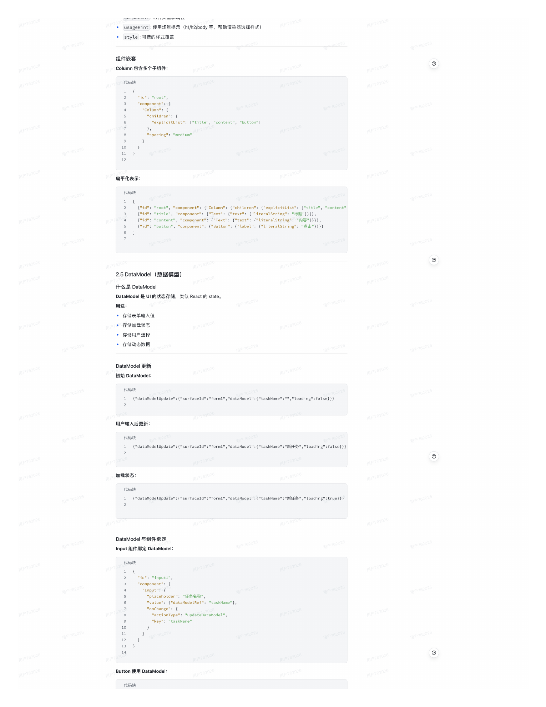

---

## 第 9 页

"component"：｛
"id"： "btni"，

"Button"：｛
"label"：｛"literalString"："创建"｝，
"onPress"：｛

"payload"："创建任务：$｛taskName｝"
"actionType"： "sendTextToAgent"，

2.6消息类型详解

服务端 客户端

消息类型
用途
格式

createSurface
创建 UI 画布
｛'surfaceId"："main"，"versio
｛"createSurface"：

n"："0.9"｝｝
用户762026

surfaceVpdate
更新组件树
｛"surfaceId"："main"，"compon
｛'surfaceVpdate"：
用户762026

uataNooeLupaaue
更新数懇模型

del"：f...｝｝
｛'surfaceId"："main"，"dataMo

beginRendering
开始渲染
｛'surfaceId"："main"，"root"：
｛"beginRendering"：

"root"｝｝

ae etesurtace
别除UI画布
｛'surfaceId"："main"｝｝
ae etesurtace

客户端 服务端

消息类型
用逸
格式

用户交互事件
｛'surfaceId"： "main"，"compon

press"｝｝
entId"："btn1"，"eventType"："

Suhuaeekeam
Surface 准备就绪
｛'surfaceId"："main"｝｝
Suruaeekeao

error
错误报告
｛"surfaceId"："main"，"messag
e"："渲染失败”｝｝

事件类型

常见用户交互事件：

eventType
说明
示例

press

change

select

scrOlL

focus

blur

2.7协议版本

v0.8（当前主流）

支持的消息类型：

surfaceUpdate

beginkendening

deleteSurface

特点：

• 隐式创建 Surface（不需要 createSurface）

• 基础组件：Text、Button、
coumn.
Row

• 不支持 dataModelUpdate

示例：

代码块

｛"surfaceVpdate"： ｛"'surfaceId"："main"， "components"：［.•.］｝｝
｛'beginRendering"： ｛"'surfaceId"："main"，"root"："root"］｝

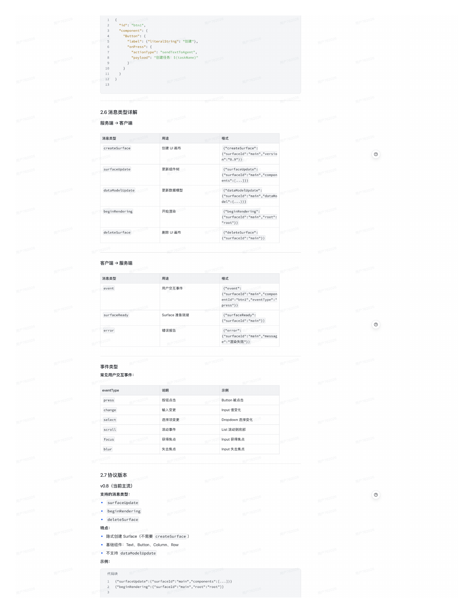

---

## 第 10 页

v0.9（最新）

新增功能：

createSurface 显式创建

dataModelUpdate 状态管理

• 新增组件：Chart、List、Card、Input

• 支持增量更新（Diff + Patch）

示例：

代码块

｛'surfaceVpdate"： ｛"surfaceId"："main"，"components"：L..1｝｝
｛"createSurface"：｛"surfaceid"："main"，"version"："0.9"｝｝

｛'beginRendering"：｛"surfaceId"："main"，"root"："root"｝｝
｛'dataModelUpdate"： ｛'surfaceId"："main"， "dataModel"： ｛"Loading"：false｝｝｝

版本兼容

握手阶段协商版本：

代码块
客户端 -服务端：
｛"capabilityExchange"： ｛supportedVersions"： ［"0.8"，"0.9"］｝］

服务端 -客户端：
se ectedVersion

降级策略：

代码块

- 服务端使用 v0.8 协议
如果客户端只支持 v8.8：

- 每次更新发送完整组件树（不支持增量）
- 不使用 dataModelUpdate

2.8完整示例

示例：简单卡片

完整消息流：

代码块
tcreatesurtace: surtace_d:cardu, version:6.9」｝
｛'surfacelpdate"： ｛"surfaceId"："cardi"，"components"： ［
｛"id"："root"， "component"：｛'Column"： ｛"children"：｛"explicitList"：［"title"， "content"］｝｝｝｝，

｛"id"："content"，"component"：｛"Text"：｛"text"：｛"literalstring"："北京今天晴，15*C"3，"usageHin
｛"id"："title"，"component"：｛"Text"：｛'"text"：｛"LiteralString"："天气卡片"｝，"usageHint"："h1"｝｝

1H｝
｛"beginRendering"： ｛"'surfaceId"："card1"，"root"："root"｝｝

渲染效果：

代码块

天气卡片

北京今天晴，15°C

示例：交互式表单

完整消息流：

代码块

｛'surfacelpdate"： ｛"surfaceId"："form1"，"components"：［
｛'"createSurface"： ｛"surfaceId"："form1"， "version"："8.9"｝］

｛"id"："root"，"component"：｛"Column"：｛"children"：｛"explicitList"：［"title"，"input"， "button"|
｛"id"："title"，"component"： ｛"Text"：｛"text"：｛"literalstring"："创建任务"｝，"usageHint"："h2"｝｝］

｛'id"："button"，"component"：｛"Button"：［"label"：｛"literalString"："创建"］，"onPress"： ｛"action
｛"id"："input"，"component"：｛"Input"：｛"placeholder"："任务名称"，"onChange"： ｛'"actionType"："upc

｛"dataModelUpdate"：｛"surfaceId"： "form2"， "dataModel"：｛"taskName"：""］｝｝
｛"beginRendering"：｛"surfaceId"："form_"，"root"："root”｝

用户交互流程：

代码块

1．用户输入"新任务"

2.客户端发送 event：｛"eventType"："'change"，"value"："新任务"｝

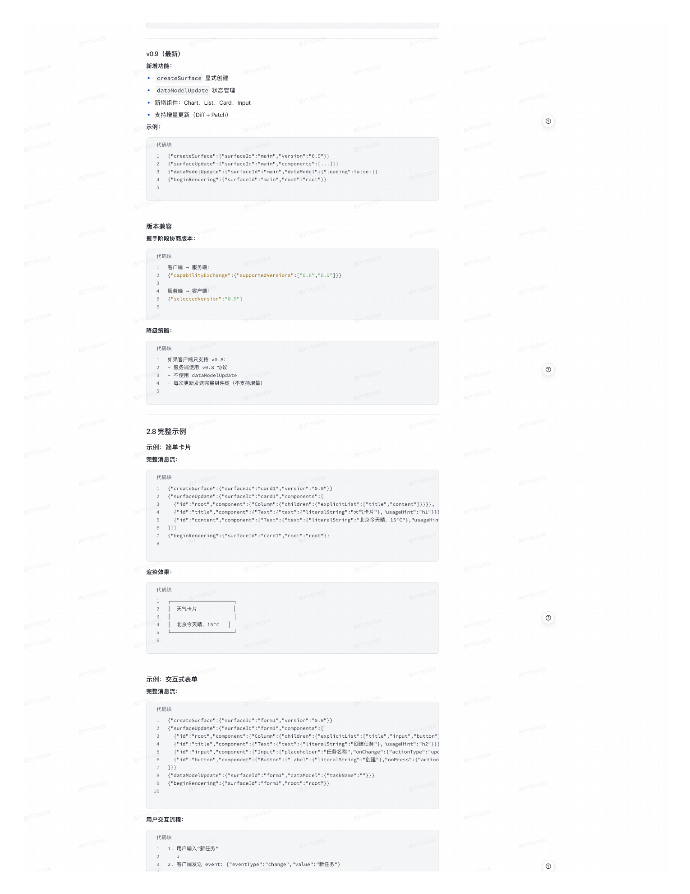

---

## 第 11 页

3.服务嘴更新 DataModel：｛"dataNodelUpdate"：｛"dataModel"：｛"taskName"："新任务"｝｝｝

4. 用 念山 ES
用户762026

5.客户端发送 event：｛"eventType"："press"｝

11
6.服务端收到：sendTextToAgent（"创建任务：新任务"）

第3章：A2UI 核心组件架构

"理解 A2UI 如何工作：从 Agent 到像素的完整链路。"

3.1 整体架构概览

（保持原内容不变）

3.2 AG-UI 协议详解

户界面应用之间的双向通信。
AG-UI （Agent-User Interaction Protocol）是一个开放、轻量级、基于事件的协议，用于标准化 AI Agent 与用

AG-UI vS A2UI VS MCP VS A2A

协议
全称
职贲
来源

Agent-User Interaction
Agent 用户双向交互协
议-事件流、状态同步
CopilotKit

A2UI
Agent-to-UI
生成式UI 规范-UI组件
树、JSONL格式
Google

MCP
Mocel Coniext Frorocol
Agent 工具/数据连接协

Agent-to-Agent
Agent+Agent 协作协议
Google

关系说明：
AG-UI 可以配合 A2UI使用-AG-UI 提供双向运行时连接，A2UI提供生成式UI规范。

AG-UI事件类型总览（16+种事件，7大类）

分类
事件
用途

生命周期事件

RUN_ERROR、
RUN_FINISHED、
监控 Agent 运行

STEP_STARTED/FINISHED

文本消息事件
/END
流式文本

工具调用事件
ESULT
TOOL_CALL_START/ARGS/END/R
工具执行

状态管理事件
STATE_DELTA、
STATE_SNAPSHOT）、
状态同步

活动事件
活动进度

推理事件
END
KEASUNLNG_S AR YMESSAGE_*/
LLM 推理可见性

特殊事件
RAW，
CUSTOM
扩展功能

核心事件示例

KUN OIAKIEU

代码块

｛"type"："RUN_STARTED"，"threadId"："thread-1"，"runId"："run-1"｝

TEXT_MESSAGE_CONTENT

代码块

｛"type"："TEXT_MESSAGE_CONTENT"，"messageId"： "msg1"，"delta"："你好….."］

TOOL_CALL_RESULT

代码块

｛"type"；"TOOL_CALL_RESULT"，"toolCallId"："tc1"，"content"；"搜索结果"｝

STATE_DELTA

代码块

｛"type"：“STATE_DELTA"，"delta"：［｛"op"："replace"，"path"："/user"，"value"："李四”3］｝

AG-UI 传输机制

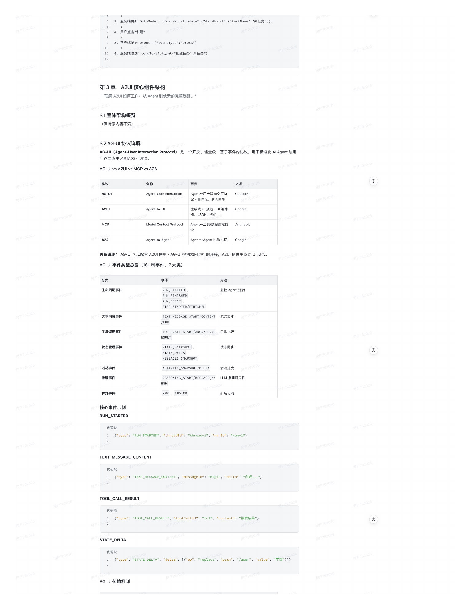

---

## 第 12 页

传输方式
说明
适用场景

Server-sent Fyente
广泛兼容，易于调试

HiIP binary
高性能

全双工通信
双向实时

eonook
回调通知
异步推送

AG-UI 与 A2UI集成

AG-UI 支持 A2UI 作为 Generative UI 事件：

代码块
'avu1_surtace_update,value:L surtaceUpdate：...」

参考资料
用户762026

• AG-UI 官方文档：https://docs.ag-ui.com/

• GitHub: https://github.com/ag-ui-protocol/ag-ui

3.3 协议解析器 （Parser）

职责

Parser 负责将 SSE 传输的 JSONL流解析为内部数据结构，核心职责：

• 逐行读取 JSONL流

• 验证 JSON 格式

• 解析消息类型 （createSurface、surfaceUpdate、beginRendering等）

•提取组件数据

• 错误处理与恢复（跳过无效行，不中断整体流程）

解析器架构

代码块

Line
Reader
JSON
Validator

Dispatcher
Message Type

17

关键设计点

1.流式解析

• 逐行处理，不等待完整数据

• 支持增量渲染（先解析先渲染）

• 内存效率高（不缓存全部数据）

2. 容错处理

• 无效 JSON 行：记录日志并跳过

• 未知消息类型：忽略并继续

• 解析错误不中断整体流程

3. 消息类型识别

createSurface：创建新 Surface

surfaceUpdate：更新组件树

dataModelUpdate：更新数据状态

• beginRendering：开始渲染

• deleteSurface：删除 Surface

3.4树构建器（Tree Builder）

职责

Tree Builder 负责将 Parser 输出的扁平组件列表转换为树形结构，
核心职责：

• 接收扁平组件列表（Parser 输出）

• 根据组件引用关系构建树形结构

• 检测循环引用（防止 AI 生成错误定义导致无限递归）

• 输出渲染器可用的树形数据结构

为什么需要树构建

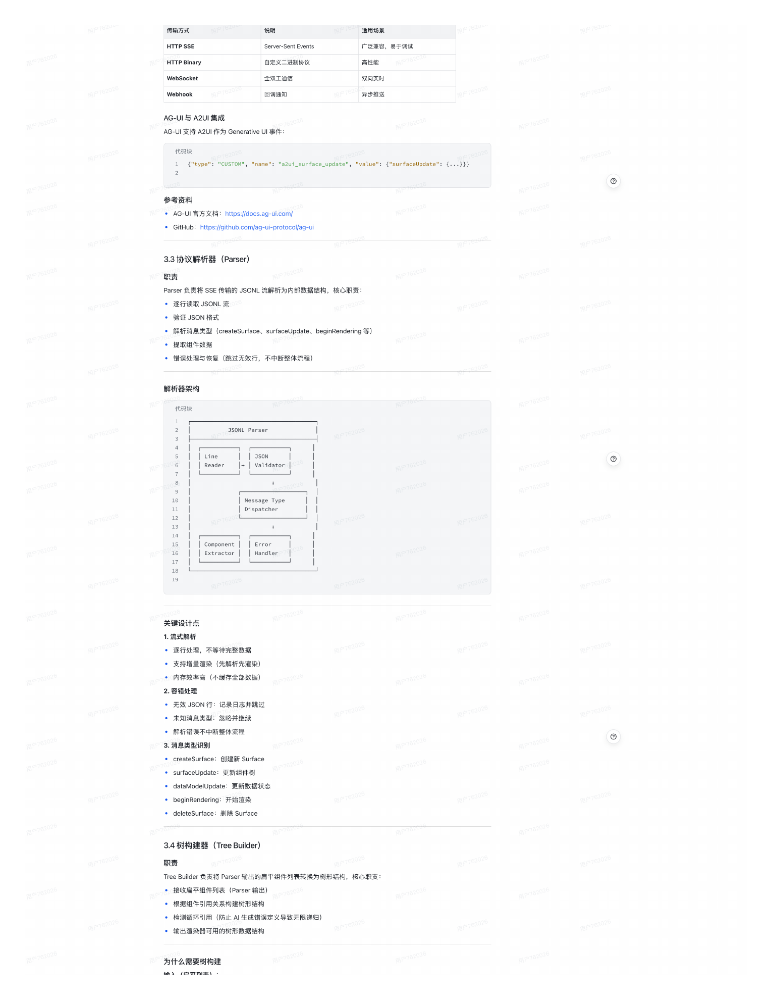

---

## 第 13 页

代码块

｛id： "title"，component： ｛ Text： ｛ text："标题"了了｝，
｛ id： "root"，component：｛ Column：｛ children：［"title"， "content"］ ｝｝｝，

｛ id："content"，component：｛ Text： ｛ text："内容"｝｝〕

输出（树形结构）：

代码块

•content（Text）•"穴容"！
title （Text）："标题"

原因：

• 扁平列表适合传输（JSONL 格式）

• 树形结构适合渲染（递归处理）

• 解耦传输层和渲染层

循环引用检测

为什么需要检测：

•协议是 AI生成的，可能存在错误引用

• 防止无限送归导致栈滋出

• 防御性编程，避免 DoS 攻击

示例（AI 生成的错误定义）：
③

代码块

｛ id：
10：
"A"，component： ｛ Column： ｛ children： ［"B"］ ｝｝ ｝，
"B"， component： ｛ Column： ｛ children： ［"A"］ 3 〕 ｝
1/ X 循环引用！

检测机制：

• 记录当前访问路径

• 发现节点已在路径中 -抛出错误
用户762026

。终止构建，返回错误信息

关键设计点

1. 访问路径追踪

• 记录从根节点到当前节点的路径

•每次递归前检查是否已访问

• 递归完成后从路径中移除

2.错误处理

• 缺失节点ID：返回 null或占位符

• 循环引用：抛出错误，终止构建

•部分构建失败：已构建部分可丢弃

3. 性能优化
用户762026
用户762026

• 使用 Map 缓存已构建节点（避免重复构建）

• 递归深度限制（防止栈溢出）

3.5渲染器 （Renderer）

职责

Renderer 负责将树形结构映射为平台原生组件并显示，核心职责：

• 接收树形结构（Tree Builder 输出）

• 映射到平台原生组件（DOM、SwiftUI、
Compose等）

• 处理样式和布局

• 响应用户交互（点击、输入等）

• 支持增量更新（只更新变化的部分）

三层架构设计：

代码块

10
React 适配器
SwiftUI

11
适配器
适配器
Compose

12
React DOM
UIKit/SwiftUI
Android Views

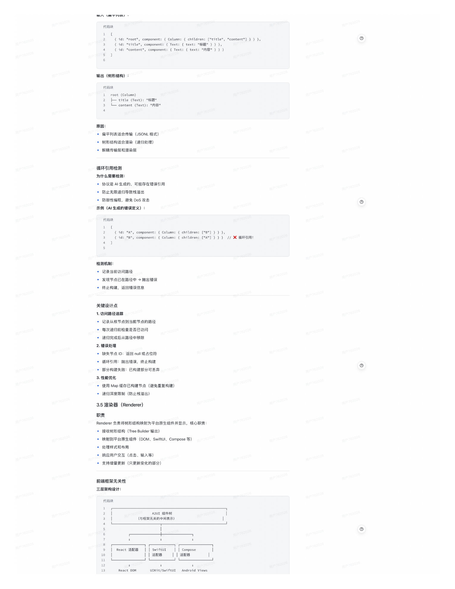

---

## 第 14 页

关键设计原则：

1.中间表示层（IR）

• A2UI 组件树是框架无关的标准格式

• 不依赖任何前端框架的 API

2. 适配器模式

。每个框架实现一个适配器

• 适配器负责：A2UI组件 框架组件 的映射

3. 统一接口

。 所有适配器实现相同的接口

。 上层逻辑无需关心具体框架

核心组件

1. 组件映射器 （Component Mapper）

• A2UI 组件类型 框架组件
用户762026

• 示例：Text 
/ Text（）/text（）

• 支持自定义组件注册

2. 样式系统（Style System）

• A2UI 样式令牌 框架样式

•支持主题配置

• 响应式布局适配

3. 事件处理器（Event Handler）

• 绑定用户交互事件（点击、输入、滚动等）

• 转发事件到服务端

• 支持事件防抖和节流

关键设计点

1.组件复用

• 相同组件 ID 复用实例

• 减少 DOM/视图创建开销

• 保持组件状态（输入框内容等）

2.懒加载

•首屏优先渲染

• 离屏内容延迟渲染

• 滚动时动态加载

用户762026

3.6 完整数据流示例

从 Agent到像素的完整链路

代码块

1.Agent 生成 UI 描述

2．JSONL 序列化

3. SSE 传输到客户端（AGUI 协议）

4. Parser 莉行JsONL 半组件 表

componentMap 构建 - Mapsid, A2UIComponentDef>

render 阶段 - hydrateMap<id, VNode：

treeBuild 阶段 - 完整的组件树

核心数据结构

1.componentMap（组件定义）

代码块
Mapsstring. A2UIComponentDet>

"root"： ｛ type："Column"， children： ［"title"， "content"］ ｝，

"content"： ｛ type： "Text"，text："内容"｝
"title"： ｛ type： "Text"，text："标题"），

2. hydrateMap（渲染实例）

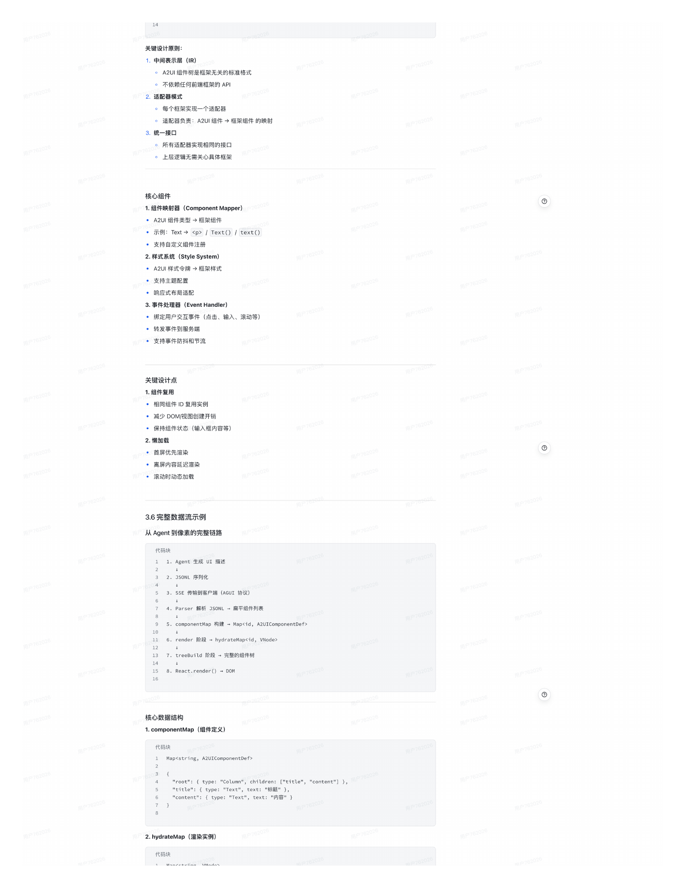

---

## 第 15 页

"content"：WNode ｛ type： "p"，props： ｛...｝，children: null ｝
"title"： Wode ｛ type： "p"， props： ｛...｝，children: null ｝，
"root"： VNode ｛ type："div"， props： ｛...｝， children: nuLl ｝，

此时 vnode.children 为空，等待 treeBuild 关联

3. 完整组件树（关联后）

代码块

10•500¢，

cna aren.
type： "div"，

viode t 10：
"content"，type:mp"， ... 3

三阶段渲染流程

阶段1:render（只渲染，不关联）

• 遍历 componentMap，逐个渲染

• 每个组件创建独立 vnode 实例

• 此时 vnode.children 为空/未关联

• 所有 vnode 存储在 hydrateMap 中

阶段 2:treeBuild（只关联，不渲染）
• 从 hydrateMap 取 vnode，
不调用 render

• 根据 componentMap 的 children 引用关联

• 递归构建完整树结构

• 检测循环引用（防御 AI 生成错误）

阶段 3：最终渲染

• React.render（rootVNode, container）

• 渲染为实际 DOM

render 与 treeBuild 的关系

代码块

componentMap - render（） - hydrateMap - treeBuild（）- 完鉴树 - React.render（）- DOM
用户762021

关键点：

• render 创建 vnode，但不关联 children

treeBuild 从 hydrateMap 取 vnode，只关联 children

• 最终树通过 vnode.children 引用形成
用户762026

• React.render 一次性渲染完整树

每个组件的作用

组件
位置
输入
输出
存储

客户端
JSONLX.
扁平组件列表

componentMap
客户端
扁平列表
Map<id，组件定义>
componentMap

客户端
组件定义
vNode
hydrateMap

treeBuild
客户端
root ID
完盛组件树

Renderer
客户端
完蹩树
DOM

增量更新优化

场景：只更新部分组件

• 只re-render 变化的组件（更新 hydrateMap）

treeBuild 复用未变化的 vnode

• 避免全量 re-render

• 保持组件状态（输入框内容等）

3.7小结

A2UI 核心组件：

组件
职责

传输层（SSE）+ AGUI 协议
建立连接，推送 UI更新，转发用户事件

解析器（Parser）
解析 JSONL 流，提取组件数据

存储 A2UI 组件定义（模板）

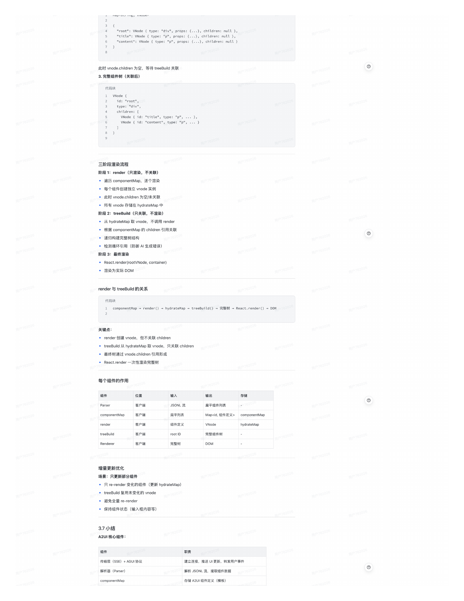

---

## 第 16 页

render
渲染组件为 vnode，存储到 hydrateMap

ivaTalemat
存储渲染后的 vnode 实例指针

treeBuild
关联 vnode 的 children，枸建完整树

kelaerel
将完整树渲染为 DOM

三阶段渲染流程：

代码块

1.render 阶段
迪历 componentMap - 创建 vnode•存储
（只渲染，
不关联）
hydrateMap

2.
treeBuild 阶段
从 hydrateMap 取 vnode - 关联 children - 完釐树
（只关联，不渲染）

最终渲染
Keact.renger uroot oge, convaner.

关键设计原则：

代码块
Ni render 5 treeBuiLd 解料

循环引用检测，防御 AI 生成错误
辺 hydrateMap 存储 vnode 指针，支持复用

平台无关：同一份描述多端一致
⑦ 增量更新：只 re-render 变化的组件

⑦ SSE + AGUI 协议：简单、可靠、防火墙友好
用户762026
用户762026
用户762026

第4章：AI编程与工程最佳实践

4.1AI编程范式

AI 辅助开发的三种模式

模式1:AI 生成代码（Copilot 模式）

代码块

人类：定义接口+写测试

人类：审查＋ 调整

适用场景：

• 样板代码（CRUD、数据转换）

• 单元测试生成
• 已知模式的实现（适配器、解析器）

模式 2:AI代码审查（Reviewer 模式）

AI：审查代码，指出问题
人类：编写代码

人类：根据建议修改

适用场景：

• 代码规范检查

• 潜在 Bug 发现

• 性能优化建议

模式 3:AI 重构助手（Refactor 模式）

代码块
人类：提供旧代码+重构目标
AI：生成重构后代码+ 迁移指南
人类：验证功能一致性

AI 编程的边界

适合 AI做的：

• ⑦样板代码生成

•辽单元测试编写

• 辽文档生成

• 辽代码审查

•辽已知模式实现

不适合 AI做的：

• X核心架构決策

•×业务逻辑设计

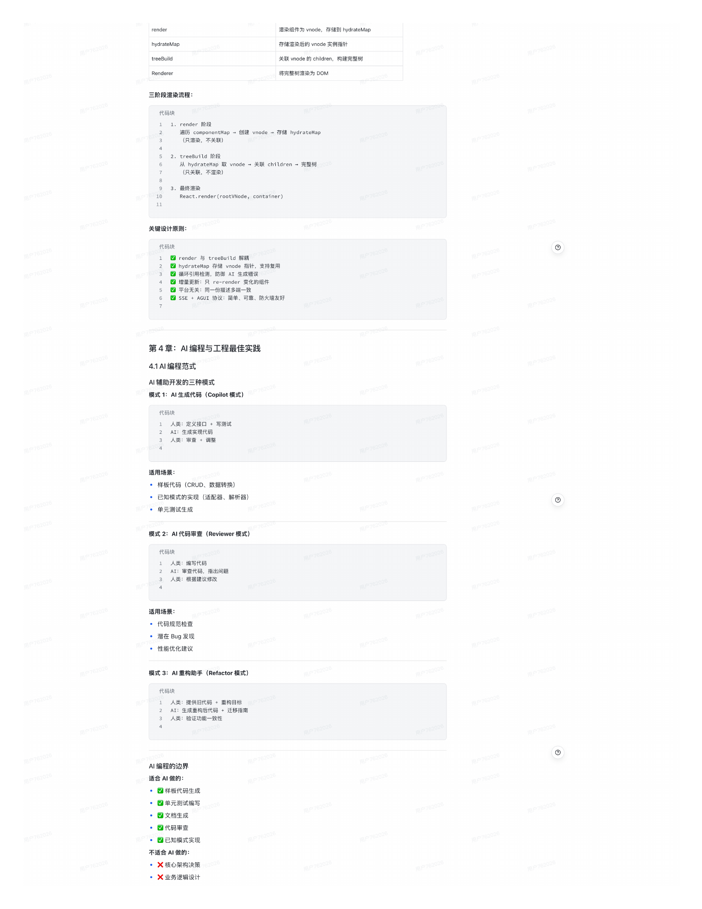

---

## 第 17 页

•X安全敏感代码

• ×性能关键路径

4.2测试驱动开发
（TDD）

TDD 在 A2UI 项目中的实践

红-绿 - 重构循环：

代码块

1.红：先写失败的测试

3.重构：优化优码，保持测试通过
2.绿：写录少代码让测试通过
用户762026

重复
用户762026

积定702026
用户762026

测试金字塔
用户762026

代码块

端到端测试（1⑧%）

nteeraton
集成测试 （20%）

unatTosto
用户762026
用户762021

A2UI 项目测试分布：

• 单元测试（70%）：Parser、TreeBuilder、Renderer 单个类测试

• 集成测试（20%）：Parser + TreeBuilder 协作测试

• E2E 测试（10%）：完整 A2UI流程测试

4.3 Spec驱动开发

Spec 示例：A2UI 协议规范

代码块

* A2UI 秘议消息（服务端-客户端）

type ServerMessage =|
| CreatesurfaceMessage
| SurfaceupdateMessage

I BeginRenderingMessage
DataModeLUpdateMessage

| DeleteSurfaceMessage；

1627
* 升 surtace h

Tntehtace &reateouhacemessaget
cealesunace

version: string；
surtace d: string；
// 妙议版本，如“0.9"
// Surface 唯一标识

25
26

28
27
* 更新 Surface 消息

interface SurfacelpdateMessage｛

31
30
surfaceupdate：｛
surfaceId: string；
components: Component［］；
// 組件列表
（編形）

33

* 組件定义

Tenace conponem
1a. Scr1ne：
// 組件唯一标识

［componentType:string］：ComponentProps；

* 开始渲染消息

interface BeginRenderingMessage｛

50
beginRendering：｛

51
root:string；
surfaceId: string；
// 根组件 TD

56

eventaessaae

intertace Eventhessage t

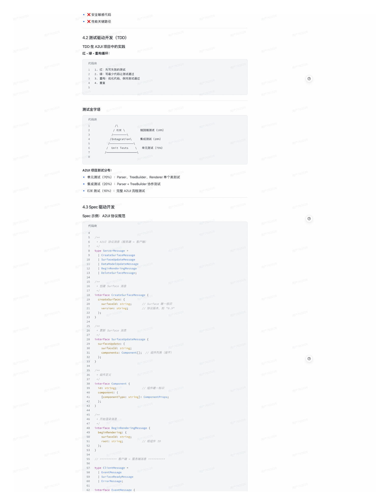

---

## 第 18 页

event：

componentId:string；
SuhTace d. Suhing

payload？：any；
eventType: string；
"change" / "select"..
用户762026

74
function isCreatesurface （msg: any）： msg is CreateSurfaceMessage ｛
return msg？.createsurface !FE undefined；

function isSurfacelpdate（msg: any）： msg is SurfaceupdateMessage ｛
msB2.surfacelpdate ！== undefined；

使用示例

根超 Spec 实现代码

parse（Line: string）： ServerMessage | null ［
const msg = JSON.parse（Line）；

if （isCreateSurface（msg））｛
return msg；

Spec 驱动的开发流程

代码块

1.定义 Spec（接口 +类型）

2． 编写基于 Spec的测试

4．根据反馈迭优 Spec

好处：

代码块

⑦ 类型安全，缤译时发现问题
⑦ 接口清晰，减少沟通成本

支持并行开发（实现方和消费方独立工作）
文档即代码，Spec就是文档

4.4完整数据流示例

从 Agent到像素的完整链路

1.Agent 生成 UI 描述

2. JSONL 序列化

3. SSE 传输到客户端
用户762026

4.Parser 解析 JSONL -扁平组件列表

10
5.componentMap 构建- Mapsid, A2UIComponentDef>

11
6. render 阶段 - hydratemaps1d, VNode

7. treeBuild 阶段 - 完整的组件树

15
8. React.render（）- DOM

核心数据结构

1.componentMap（组件定义）

代码块
Mapsstring. AzuLcomponentDet？

"root"：｛ type： "Column"，children： ［"title"， "content"］ ｝，

"content"：｛ type： "Text"，text："内容"｝
ttue: tyoe:Text,text：你邊；

2.hydrateMap
（渲染实例）

代码块
Napsstring, VNode

"root"： VNode ｛ type："div"， props： ｛...｝， children: null ｝，

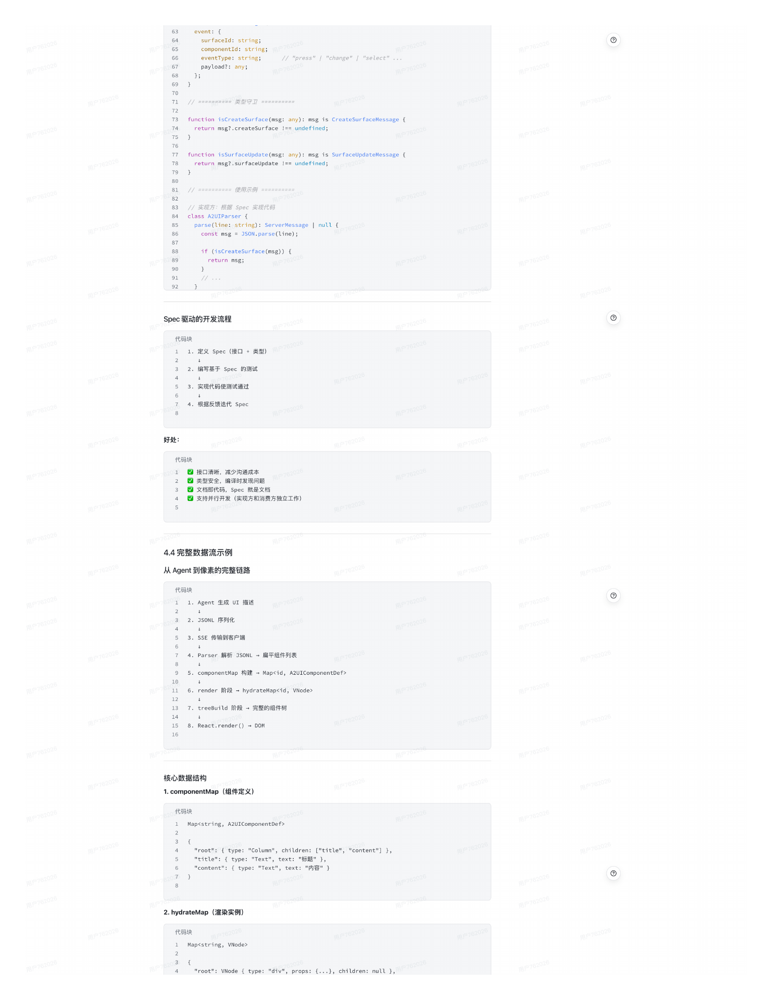

---

## 第 19 页

"title"： VNode ｛ type： "p"，props： ｛...｝，children: null ｝，
"content"： VNode ｛ type： "p"，props：｛...），children: null ｝

此时 vnode.children 为空，等待 treeBuild 关联

3.完整组件树（关联后）

代码块

WNode｛

type： "div"，
id： "root"，

chi Ldren：|
VNode ｛ id： "title"， type： "p"，
vwode ［ id: wcontent"， type： "p"， ... 3

三阶段渲染流程

阶段1:render（只渲染，不关联）

• 每个组件创建独立 vnode 实例
• 遍历 componentMap，逐个渲染

• 此时 vnode.children 为空/未关联

• 所有 vnode 存儲在 hydrateMap中

阶段 2:treeBuild（只关联，不渲染）

• 从 hydrateMap 取 vnode，不调用 render

• 根据 componentMap的 children 引用关联

• 递归构建完整树结构

• 检测循环引用（防御 AI 生成错误）

阶段 3：最终渲染

• 渲染为实际 DOM

每个组件的作用

組件
位置
输入
输出
存储

客户端
JSONL流
扁平组件列表

componentmap
容户端
扁平列表
Map<id，组件定义＞
componentMap

render
客户端
组件定义
VNode
hydrateMap

treeBuild
客户端
root ID
完丝组件树

Renderer
客户端
完堥树
DOM

vnode

容等）

4.5中心 Store 与增量动画

中心 Store 设计

为什么需要 Store：

• 各模块共享 hydrateMap、componentMap
•统一状态管理，避免参数层层传递

• 支持订阅机制，响应式更新

Store 结构：

代码块

A2UIStore

hydrateMap:Mapsid, VNode>
componentMap: Mapsid, A2UIComponentDef>

newComponentIds: Setsid>
currentSurfaceId: string | null
（新增组件标记〉

Store 核心方法

方法
用途

setComponentMap（map）
设置组件定义Map

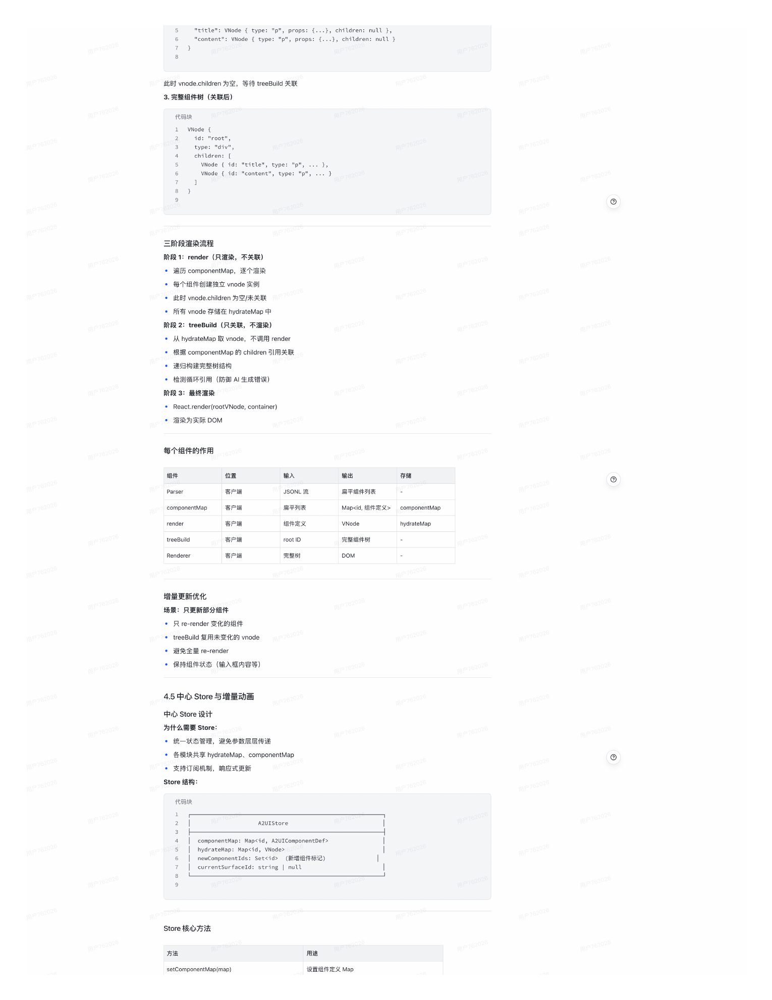

---

## 第 20 页

ceonoonenuma
获取组件定义 Map

设置渲染实例Map（自动标记新增）

获取渲染实例 Map

获取指定 vnode

检查是否为新组件

ccaNewcomoonenumao
清除新增标记（动画完成后）

setSurfaceld（id）
设置当前 Surface ID

清空 Store（新 Surface 时）

Suoseocl Suene
用户762026

订阅状态变化

标记清除法实现淡入效果

流程：

代码块

1. Parser 解析 - store.setComponentMap（）

对比旧 hydrateMap，标记新增 1D
newComponentIds = 当月 IDs-
I IDS
用户762026

3.render 阶段•store.setHvdrateMap/）
- 新组件添加 fade-in 标记

10
rreesuTio- reae.renaen

11
5.HOC 检测标记-播放淡入动画•清除标记
用户762026
用户762026

用户762026

淡入 HOC 实现

代码块

function withFadeInsP extends object>（
wrappedComponent: React.ComponentTypesP>，

）：React.FC
f
componentId: string

return function FadeInComponent （props：

const 1sNew = store.isNewComponent （componentId）；
// 从 Store 檢查是否为新組件
P）｛

React.useEffect（C） =>｛

reguestAhtmaclonhrameww -2 sewvsTbvewrueJy
用户762026

const timer = setTimeout（（） =>｛
// 动画完成后清除标记（300ms）

｝，300）；
store.clearNewComponentMark（componentId）；

return （） => clearTimeout（timer）；

｝，［componentId］）；

sdiv style=｛｛

transition：'opacity 0.3s ease-in-out'
opacity: visible ? 1:0，
用户762026

<WrappedComponent （...props｝/>

30333

完整流程

代码块

1. Parser 解析
store.setComponentMap （componentMap）

2.标记新增组件
= 当用 IDs -旧 hydrateMap IDs

3. render 阶的
store.setHydrateMap（hydrateMap）

21
4.treeBuiLd 阶段
Ldcto a BU wnada

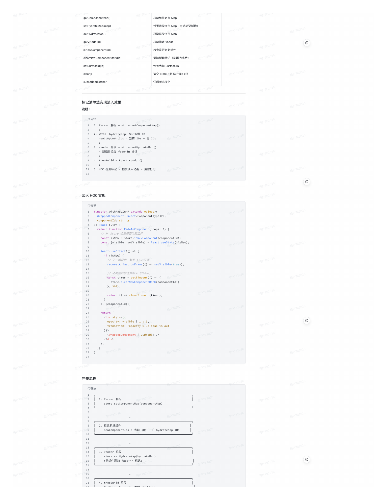

---

## 第 21 页

23

5.React.render（）
HOC 检测 isNew - 淡入动画 -清除标记

增量更新优化

场景：只更新部分组件

代码块

function updateComponent（id: string, newDef: A2UIComponentDef）•
1. 只 re-render 变化的組伴

store.getComponentMap（）.set（id, newDef）；

store.getHydrateMap（） .set （id, newNode）；
const newvNode = adapter.render （newDef, id, false）；

//不标记为新始，

function batchUpdate（newcomponents: A2U1componentDef［］） ｛
// 2. 批量更新

const oldIds = new Set（store.getHydrateMap（） .keys（））；

for （const comp of newComponents）

store.getNewComponentIds（）.add （comp.id）；79/标记新增

18

20
19
treeBuild（'root'）；
renderALlC）；
// 重新渲染

优势：

• 避免全量 re-render

• 新增组件有淡入动画

• 更新组件无动画（保持状态）

• 保持组件状态（输入框内容等）

4.6 小结

A2UI 核心组件：

组件
职责

传输层（SSE）+ AGUI 协议
建立连接，推送 UI 更新，转发用户事件

解析器（Parser）
解析 JSONL流，提取组件数据
用户762026

统一状态管理，共享 hydrateMap、componentMap

渲染组件为 vnode，存储到 hydrateMap

hydrateMap
存储渲染后的 vnode 实例指针

treeBuild
关联 vnode 的 children，构建完整树

将完整树渲染为 DOM，支持淡入动画

三阶段渲染流程：

1.render阶段
洞力 componentNap - ag vnode • 仔格 hvarateMap
（只渲染，不关联）

treeBuild 阶段
从 hydrateMap 取 vnode • 关联 children - 完盤树
（只关联，不渲染）

3.最终渲染
keact.rendertroocvRooe, conualneh，

用户762026

关键设计原则：

代码块
V render 与 treeBuild 解粉
V中心 Store 统一状态管理

⑦ 循环引用检测，防御 AI 生成错误
⑦ 标记清除法实现淡入动画

习 平台无关：同一份描述多端一致
V培量申新：只 re-render 变化的给作

⑦ SSE +AGUI 协议：简单、可靠、防火墻友好

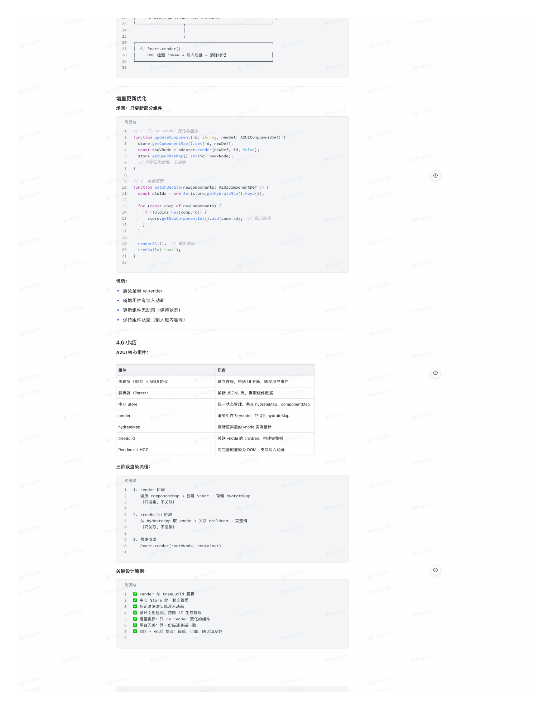

---

## 第 22 页

你可能还想问（6）

C MCP 协议与 Skills技术教程|从原理到开发实趺

《 LLM基础入门教程|涵盖知识、环境搭建与普及原因

？3个技巧，教你实现生成式 UI 的高效应用

生成式 UI 与传统UI 的优劣对比

A2UI实战2内容分享-UI实现、框架构成及作业要求

L JavaScript 训练营课程|从基础到核心原理学习

0- 真诚点资，手留余否

羭入评诊

---
