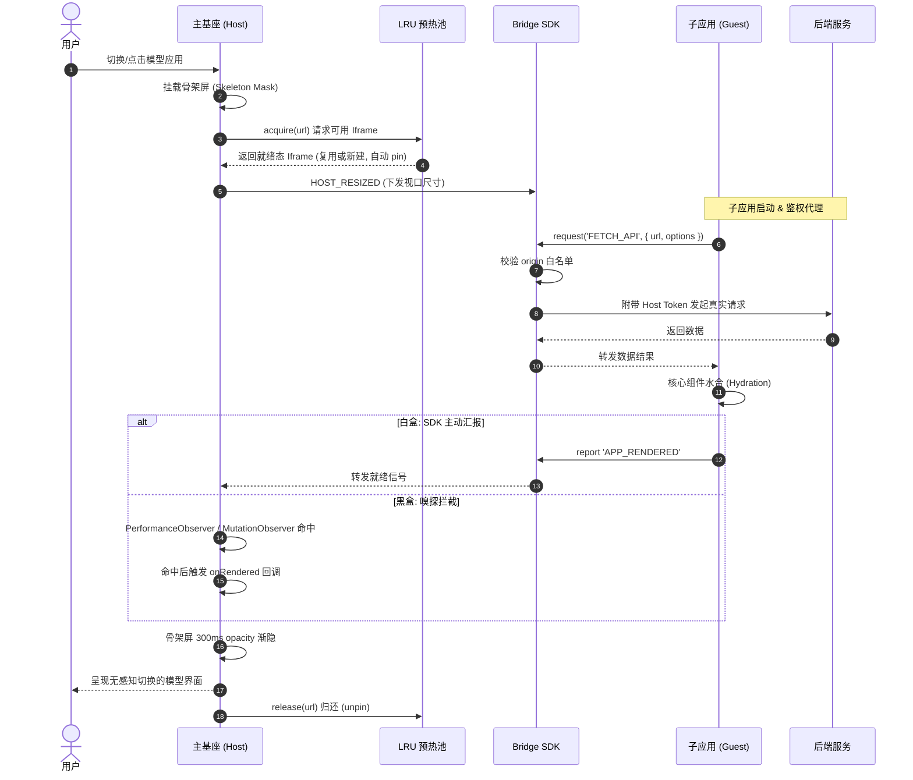

# 软件设计文档 (SDD)：星轨 (Orbit) v2.0 - 异构微前端架构设计

## 1. 概述与背景

随着 AI 业务的爆发，前端控制台需要接入大量由不同算法团队开发的异构模型 Demo（技术栈涵盖 Python Streamlit, Gradio, 原生 WebGL, React 等）。
为了在不魔改异构子应用代码的前提下，实现**物理防爆隔离**、**极速冷启动**与**丝滑的单页级用户体验**，特设计本套纯 `iframe` 架构演进方案——星轨 (Orbit) v2.0。

### 1.1 术语定义

| 术语 | 含义 |
|------|------|
| **基座 (Host)** | 主前端应用，负责鉴权、路由、骨架屏、iframe 生命周期管理 |
| **子应用 (Guest)** | 被 iframe 包裹的第三方 AI 模型 Demo 页面 |
| **白盒应用** | 集成了 Orbit Bridge SDK，可主动上报状态的子应用 |
| **黑盒应用** | 未集成 SDK、完全不可控的第三方页面（如 Streamlit / Gradio 原生部署） |
| **pinned / unpinned** | 预热池中 iframe 的两种状态：pinned 正在被用户查看（受保护），unpinned 在池中闲置（可被 LRU 淘汰） |

## 2. 设计目标与核心指标

1. **绝对的物理防爆边界：** 必须隔离 DOM 和 JS 上下文，防止不可信代码导致主基座崩溃，保证 GPU 加速资源（WebGL）的独立运作。
2. **零闪烁无感知加载：** 消灭 `iframe` 传统的白屏和布局抖动，视觉控制权 100% 收归主基座。
3. **极速可用状态：** 模型冷启动从 `> 5秒` 缩短至 `< 1秒`（通过预热池和预加载缓存）。
4. **单点事实与安全穿透：** 鉴权 Token 统一由基座保管，子应用通过高频消息总线或拦截代理获得网络能力，确保权限同步。

## 3. 架构全景蓝图

系统核心由四大引擎支撑：

* **核心 1：通信与控制总线 (Bridge SDK)**
  * **机制：** 弃用原生单向 `postMessage`，封装基于 JSON-RPC 2.0 规范的 Promise 双向异步调用 `IframeBridge`。
  * **安全防线：** `targetOrigin` **必填**，禁止生产环境使用 `'*'`；`handleMessage` 内置 `event.origin` 白名单校验，拒绝非授信来源的消息。
  * **能力：** 支持超时熔断（自动清理未决 Promise，防止内存泄漏）；支持并发控制（`p-limit`，默认最大并发 6）；支持“UI越权”（例如子应用通过 Bridge 指挥主基座渲染全局弹窗，突破流式布局限制）。

* **核心 2：无感知预热池 (LRU Iframe Pool)**
  * **机制：** 离线维护分为「pinned」（正被用户查看，受保护）和「unpinned」（池中闲置）两种状态；LRU 淘汰**仅作用于 unpinned 节点**。
  * **内存自适应：** `maxSize` 默认值 3，实际运行时根据 `navigator.deviceMemory` 和设备类型动态降级（移动端默认 1，桌面端默认 3）。
  * **重置策略：** 复用时先置 `src = 'about:blank'` 销毁旧上下文，延迟 1 帧（`requestAnimationFrame`）后再赋值新 URL；该开销纳入预热命中判断——若 `about:blank` → 新 URL 的冷启动耗时超过阈值，直接新建 iframe。
  * **隐藏方式：** 使用 `position: fixed; top: 0; left: 0; width: 1px; height: 1px; opacity: 0; pointer-events: none;` 实现完全不可见但浏览器仍正常渲染（确保 Streamlit/Gradio 的 WebSocket 握手不被暂停）。

* **核心 3：流式布局与响应式防线 (Layout & Resize Guard)**
  * **布局反转：** 坚持基座霸权，使用 `min-height: 0; overflow: hidden;` 死死锁死 iframe 的外层容器边界。
  * **尺寸探针：** 基座侧监听容器 `width` 并高频下发；子应用内部监听内容 `height` 并高频上报。
  * **防崩溃锁：** 引入 `requestAnimationFrame` 配合 `lodash.debounce` 以及 `5px` 变化容差阈值（Threshold），彻底切断可能导致的“容器互相撑开死循环（Infinite Resize Loop）”。

* **核心 4：复合视觉嗅探状态机 (Hybrid Sniffer & Handover)**
  * **白盒应用：** 接收 SDK 抛出的 `APP_RENDERED` 信号；额外支持 `HEALTH_CHECK` 心跳探测，基座定期轮询子应用存活状态。
  * **黑盒应用：** 拦截 Fetch API 或使用 `PerformanceObserver` 监听特定的 WebSocket 握手状态。
  * **兜底策略：** 注入 `MutationObserver` 探测核心组件是否挂载。
  * **选择器配置化：** 上述监听的目标（WebSocket 端点、DOM 选择器、超时阈值）**禁止硬编码**，全部通过统一的 `SnifferConfig` 配置文件下发，支持按 `frameworkType` + `version` 匹配策略，版本升级时热更新规则而不发版。
  * **视觉平滑交接：** 探测成功后，覆盖在 iframe 表层的骨架屏不直接消失，而是执行 `300ms` 的 `opacity` 渐隐；若超时仍未就绪，显示「继续加载中」的半透明蒙层（而非完全移除骨架屏暴露潜在白屏）。

---

## 4. 核心系统时序图

以下时序描述了用户触发模型切换，直到完美加载展现的全流程。



> **与初版的区别**：修复了原图中 `Host->>Bridge` 黑盒嗅探的架构错误（黑盒场景下 Host 直接操作 iframe DOM，不经过 Bridge），明确了 acquire/release 的 pin 语义，去掉了并行块中不应并行的鉴权逻辑。

---

## 5. API 与核心模块接口定义

### 5.1 异步通信 Bridge SDK 定义

基于双向通讯设计的轻量级 RPC。

```typescript
// 通信标准协议
interface BridgeMessage<T = any> {
  id: string;          // 请求/响应 的唯一追踪 ID
  action: string;      // 调用的事件标识，如 'GET_TOKEN'
  payload?: T;         // 数据负载
  isResponse?: boolean;// 用于识别是主动请求还是回调结果
  error?: string;      // 错误透传
}

// 核心类声明
class IframeBridge {
  // targetOrigin 必填，无默认值；allowedOrigins 做消息来源白名单校验
  constructor(targetWindow: Window, targetOrigin: string, allowedOrigins: string[]);

  // 拦截 iframe 的原生 postMessage，内置 event.origin 校验
  private async handleMessage(event: MessageEvent): Promise<void>;

  // 主动调用对方能力，并等待对方 return 结果 (支持超时设定)
  // 内部使用 p-limit 控制并发 (默认 6)，超时自动清理未决 Promise
  public request<T>(action: string, payload?: any, timeoutMs?: number): Promise<T>;

  // 注册自身的能力供对方调用
  public on(action: string, handler: (payload: any) => any | Promise<any>): void;

  // 发送单向广播 (不等待响应)
  public broadcast(action: string, payload?: any): void;
}
```

### 5.2 LRU 预热池接口定义

```typescript
// 预热池管理类
class IframePoolManager {
  private maxSize: number; // 根据 deviceMemory 动态计算：移动端 1，桌面端 3
  private pinnedUrls: Set<string>; // 正在使用中的 URL，受保护不参与淘汰

  // 静默预加载核心资源
  public preload(url: string): void;

  // 获取可用的沙箱实例 (命中 pool 则复用，未命中则新建)；
  // 返回后自动将该实例标记为 pinned
  public acquire(url: string): HTMLIFrameElement;

  // 用户离开页面时调用，解除 pinned 状态，归还到池中
  public release(url: string): void;

  // 手动清理长期不活跃的 unpinned 节点并解绑事件以防内存泄露
  public evictStaleNodes(): void;

  // 重置已污染的 iframe (设为 about:blank 后 1 RAF 再赋新 URL)
  private resetIframe(iframe: HTMLIFrameElement): Promise<void>;
}
```

### 5.3 混合视觉嗅探器定义

```typescript
// 嗅探规则配置（动态下发，无需发版即可适配框架版本升级）
interface SnifferConfig {
  frameworkType: 'gradio' | 'streamlit' | 'custom';
  version?: string;                    // 版本匹配，如 "^4.0"
  wsEndpoints: string[];               // WebSocket 端点特征，如 ["/_stcore/stream"]
  domSelectors: string[];              // DOM 选择器特征，如 [".gradio-container"]
  healthCheck?: {                      // 白盒场景可选心跳
    interval: number;                  // 轮询间隔 ms
    actions: string[];                 // 心跳消息 action 名
  };
  timeout: number;                     // 超时阈值 ms，可配置，不再硬编码 10s
}

// 混合探测器：支持远程配置动态更新
function createHybridSniffer(
  config: SnifferConfig,
  bridge?: IframeBridge,
): {
  watch(iframeWindow: Window, onRendered: () => void, onTimeout: () => void): () => void;
  updateConfig(newConfig: Partial<SnifferConfig>): void;
} {
  // 三层降级策略:
  // Level 1: Bridge 主动通讯 / HEALTH_CHECK 心跳 (白盒)
  // Level 2: PerformanceObserver 监控 WebSocket 握手 (黑盒)
  // Level 3: MutationObserver 监听特定 Selector (兜底)
  // 超时后调用 onTimeout（显示「继续加载中」蒙层）而非完全放弃
}
```

## 6. 异常应对机制（降级方案）

| 风险场景 | 影响后果 | 应对降级方案 (Fallback) |
| :--- | :--- | :--- |
| **API/Token 代理请求失败** | 模型彻底不可用，数据接口返回 401 | Bridge 向基座抛出错误，骨架屏停止动画，切换为“全局断网/授权异常”错误页提供重试；同时上报异常日志到监控平台。 |
| **Gradio/Streamlit DOM 探测全失败** | 骨架屏长久覆盖，死锁白屏 | 嗅探器 `timeout` 通过 `SnifferConfig` 可配置（默认 `10s`，大模型部署场景建议 `30s`），超时后**不直接暴露原始 iframe**，而是显示「模型加载中，请稍候...」的半透明蒙层 + 刷新按钮，兼顾体验与兜底。 |
| **跨域导致 ResizeObserver 失效** | 内部存在滚动条，布局不优雅 | 通过配置主基座 Nginx 将模型环境挂载在相同的二级域名下（同源策略 `example.com/models/xxx`），强制变为可操控状态；无法同源时降级使用 `IntersectionObserver` 估算高度。 |
| **预热池 iframe 内存泄漏** | 长时间运行后页面卡顿甚至崩溃 | `evictStaleNodes` 每 60 秒执行一次：卸载 `message`/`resize` 监听器，`src = 'about:blank'`，移除 DOM。增加 `performance.memory` 监控告警。 |
| **框架版本升级导致嗅探失效** | 子应用总是触发超时降级 | 运维通过更新 `SnifferConfig` 远程配置（不重启前端），按 version 匹配新选择器；嗅探失败率超过阈值时自动告警。 |

---

## 7. 子应用生命周期管理

```
              ┌──────────────────────────────────────┐
              │           生命周期状态机               │
              └──────────────────────────────────────┘

  Pool.preload(url)
      │
      ▼
  ┌─────────┐   acquire()   ┌──────────┐   用户离开    ┌──────────┐
  │ IDLE    │ ────────────► │ ACTIVE   │ ───────────► │ DORMANT  │
  │ (池中闲置)│              │ (用户可见) │  release()   │ (归还池中) │
  └─────────┘               └──────────┘              └──────────┘
      │                          │                        │
      │      LRU 淘汰            │      页面卸载           │      LRU 淘汰
      ▼                          ▼                        ▼
  ┌─────────┐               ┌──────────┐
  │ DESTROY │               │ DESTROY  │
  │ (销毁)   │               │ (销毁)    │
  └─────────┘               └──────────┘
  仅 unpinned                pinned 需先
  节点                       转为 unpinned
```

- **IDLE → ACTIVE**：`acquire()` 时检查 `pool` 是否有闲置节点；有则复用（命中），无则新建（穿透），返回后自动标记为 `pinned`。
- **ACTIVE → DORMANT**：用户切走/关闭面板时，`release()` 解除 `pinned` 状态。不立即销毁，保留在池中供后续复用。
- **DORMANT → ACTIVE**：再次 acquire 同一 URL 时直接复用，避免反复创建销毁。
- **DESTROY**：仅针对 `unpinned` 节点。触发条件：超过 `maxSize` 的 LRU 淘汰、或超过最大空闲时间（`maxIdleMs: 5 * 60 * 1000`）的主动回收。

## 8. 可观测性 & 指标体系

所有核心路径需埋点，以下为最低跟踪指标：

| 指标 | 含义 | 告警阈值建议 |
|------|------|------------|
| `orbit.pool.hit_rate` | 预热池命中率 | < 60% 告警 |
| `orbit.pool.size_current` | 当前池中 iframe 数量 | > maxSize + 2 告警 |
| `orbit.bridge.rpc_latency_p99` | Bridge RPC 调用 P99 延迟 | > 500ms |
| `orbit.bridge.rpc_timeout_count` | Bridge 调用超时次数 | > 10/min |
| `orbit.sniffer.timeout_rate` | 嗅探超时比例 | > 20% 告警 |
| `orbit.sniffer.level_distribution` | L1/L2/L3 命中分布 | L3 占比 > 50% 需排查 |
| `orbit.iframe.memory_mb_avg` | 单 iframe 平均内存占用 | > 300MB 告警 |
| `orbit.render.time_to_visible_p95` | 从点击到可见的 P95 耗时 | > 3s |

## 9. 已知局限与取舍

| 局限 | 影响 | 取舍理由 |
|------|------|---------|
| **URL 不同步** | iframe 内导航不反映到浏览器地址栏，用户刷新后可能丢失状态 | 这是物理隔离的代价；可通过 Bridge 上报子应用内部路由状态由基座暂存 sessionStorage。 |
| **浏览器前进/后退** | iframe 内导航会污染 `history` | 建议设计上避免子应用内部多级导航，将路由逻辑收敛到基座。 |
| **移动端 iOS Safari** | iframe 高度计算异常，`position: fixed` 隐藏池可能不被渲染 | 移动端 `maxSize` 降为 1，隐藏方式改为 `opacity: 0 + pointer-events: none`。 |
| **第三方 Cookie 限制** | 子应用无法携带跨域 Cookie | 统一使用 Bridge 代理请求（方案已覆盖），子应用不自行发起网络请求。 |
| **单 iframe 内存开销** | 每个 Streamlit 实例 100-300MB | `maxSize` 受限且自适应，内存超标时主动 evict。 |

## 10. 本地开发与调试

- **独立启动**：子应用各自 `npm run dev` 后，基座通过 `.env.local` 中的 `VITE_CHILD_ORIGINS` 配置开发 origin。
- **联合调试**：基座 + 子应用同时启动，利用 Chrome DevTools → Sources → `page.getIframes()` 在 console 中列出所有 iframe 上下文。
- **Bridge 日志面板**：开发模式下在基座右下角注入浮动 Debug 面板，实时展示 Bridge 消息流（action, payload, latency），支持过滤和导出。

## 11. 浏览器兼容性矩阵

| 特性 | Chrome | Firefox | Safari | Edge |
|------|--------|---------|--------|------|
| `postMessage` + JSON-RPC | ✅ | ✅ | ✅ | ✅ |
| `PerformanceObserver` | ✅ | ✅ | ✅ 14.1+ | ✅ |
| `MutationObserver` | ✅ | ✅ | ✅ | ✅ |
| `ResizeObserver` | ✅ | ✅ | ✅ 13.1+ | ✅ |
| `requestAnimationFrame` | ✅ | ✅ | ✅ | ✅ |
| `navigator.deviceMemory` | ✅ 64+ | ❌ | ❌ | ✅ |
| `IntersectionObserver` | ✅ | ✅ | ✅ 12.1+ | ✅ |

> `deviceMemory` 不可用时默认按桌面端 3 处理。

---

# 附录：交给大模型生成代码的 System Prompts

*使用说明：按顺序分 4 次发送给 Cursor / Claude / Gemini。必须先执行 Step 0 产出共享类型文件，再以输出文件为上下文执行 Step 1-3。*

### Step 0：共享类型定义（必须最先执行）

> **角色设定**：你是一名资深前端架构师。
> **任务**：为我生成一份共享 TypeScript 类型定义文件 `orbit-types.ts`，这是后续所有模块的**接口契约**。
>
> 请严格按以下规格输出：
> ```typescript
> // === Bridge 消息协议 ===
> interface BridgeMessage<T = any> {
>   id: string;
>   action: string;
>   payload?: T;
>   isResponse?: boolean;
>   error?: string;
> }
>
> // === 嗅探器配置 (运行时可通过 API 热更新) ===
> interface SnifferConfig {
>   frameworkType: 'gradio' | 'streamlit' | 'custom';
>   version?: string;
>   wsEndpoints: string[];
>   domSelectors: string[];
>   healthCheck?: { interval: number; actions: string[] };
>   timeout: number; // ms
> }
>
> // === 预热池节点状态 ===
> type PoolNodeStatus = 'idle' | 'active' | 'dormant';
>
> interface PoolNode {
>   id: string;
>   url: string;
>   iframe: HTMLIFrameElement;
>   status: PoolNodeStatus;
>   createdAt: number;
>   lastAccessedAt: number;
> }
>
> // === Bridge 接口 ===
> interface IBridge {
>   request<T>(action: string, payload?: any, timeoutMs?: number): Promise<T>;
>   on(action: string, handler: (payload: any) => any | Promise<any>): void;
>   broadcast(action: string, payload?: any): void;
>   destroy(): void;
> }
>
> // === Pool 接口 ===
> interface IPoolManager {
>   preload(url: string): void;
>   acquire(url: string): HTMLIFrameElement;
>   release(url: string): void;
>   evictStaleNodes(): void;
>   getStats(): { size: number; hitRate: number; nodes: PoolNode[] };
> }
>
> // === 嗅探器接口 ===
> interface ISniffer {
>   watch(iframeWindow: Window, onRendered: () => void, onTimeout: () => void): () => void;
>   updateConfig(newConfig: Partial<SnifferConfig>): void;
> }
> ```
>
> 代码风格要求：使用 TypeScript 严格模式，所有公开方法添加 JSDoc，禁止使用 `any`（必要时用 `unknown`），使用 `eslint:recommended` 规则。

### Step 1：生成通信中枢与预热池（依赖 Step 0 的类型文件）

> **角色设定**：你是一名具有 10 年架构经验的前端专家。
> **任务**：基于已有的 `orbit-types.ts`（见上下文），编写 `IframeBridge` 和 `IframePoolManager` 的实现。
>
> **IframeBridge 要求**：
> 1. 基于 JSON-RPC 2.0 规范封装 `postMessage`，使用 Promise 解决跨 iframe 异步调用。
> 2. `targetOrigin` 和 `allowedOrigins` 均为**必填**，`handleMessage` 中校验 `event.origin` 白名单。
> 3. 请求超时熔断（默认 10s），超时后自动清理未决 Promise 防止内存泄漏。
> 4. 使用 `p-limit` 控制最大并发请求数（默认 6）。
> 5. `destroy()` 方法清理所有监听器和未决请求。
>
> **IframePoolManager 要求**：
> 1. 基于 LRU 策略的预热池，区分 pinned/unpinned 状态，淘汰只作用于 unpinned。
> 2. `maxSize` 根据 `navigator.deviceMemory` 动态计算（移动端 1，桌面端 3，不可用时默认 3）。
> 3. 隐藏方式：`position: fixed; width: 1px; height: 1px; opacity: 0; pointer-events: none;`（注释说明为何不用 `display:none` 或 `left:-9999px`）。
> 4. 复用时 `about:blank` → 1 RAF → 新 URL 的分步重置；若 `about:blank` 后冷启动超过阈值则不复用，直接新建。
> 5. `getStats()` 暴露命中率、节点状态等监控数据。
>
> **要求**：单元测试覆盖 (Vitest)，目录 `packages/orbit-core/src/`。

### Step 2：生成响应式布局与防死循环机制（依赖 Step 0 的类型文件）

> **角色设定**：你是一名具有 10 年架构经验的前端专家。
> **任务**：基于已有的 `orbit-types.ts`，实现 `LayoutSyncObserver`。
>
> 要求：
> 1. 基座端 `ResizeObserver` 监听包裹容器 `width`，通过 Bridge `broadcast('HOST_RESIZED', { width })` 下发给子应用。
> 2. 子应用端 SDKBridge `on('HOST_RESIZED', ...)` 接收后在内部调整 Canvas/组件比例。
> 3. 子应用端监听内部 `document.body` 高度变化，通过 `broadcast('GUEST_RESIZED', { height })` 上报基座。
> 4. **防死循环机制**（重点）：
>    - 基座给 iframe 外层容器设置 `min-height` 为子应用上报的值，但仅在差值 `> 5px` 时才更新；
>    - `requestAnimationFrame` 中完成实际 DOM 写入，合并同一帧内的多次 resize 事件；
>    - 所有尺寸变化经过 `lodash.debounce`（16ms，即约 60fps），确保不触发连锁 resize。
> 5. 基座端 CSS：`iframe-wrapper { contain: strict; overflow: hidden; min-height: 0; }`，配合 `contain: strict` 隔离布局影响。
> 6. 子应用端 CSS：`html, body { overflow: hidden; height: auto; min-height: 100%; }` + `box-sizing: border-box`。
>
> **要求**：单元测试覆盖 (Vitest)，目录 `packages/orbit-layout/src/`。

### Step 3：生成渲染状态机与视觉交接（依赖 Step 0 + Step 1 + Step 2）

> **角色设定**：你是一名具有 10 年架构经验的前端专家。
> **任务**：基于已有的 `orbit-types.ts`、`IframeBridge`、`IframePoolManager`、`LayoutSyncObserver`，实现 `HybridRenderSniffer` 和 `MicroAppContainer` 组件。
>
> **HybridRenderSniffer 要求**：
> 1. 构造函数接收 `SnifferConfig`（支持后续 `updateConfig` 热更新规则）。
> 2. 三层降级：L1 Bridge `APP_RENDERED` + `HEALTH_CHECK` 心跳；L2 `PerformanceObserver` 监听 WS 握手（端点来自 `SnifferConfig.wsEndpoints`，禁止硬编码）；L3 `MutationObserver` 监听 DOM 选择器（来自 `SnifferConfig.domSelectors`，禁止硬编码）。
> 3. 超时后调用 `onTimeout` 回调（**不直接暴露原始 iframe**），由外部决定展示蒙层策略。
> 4. `watch()` 返回取消函数，组件卸载时调用避免泄漏。
>
> **MicroAppContainer 要求**：
> 1. 基于 React（函数组件 + Hooks），整合 `IframePoolManager`、`LayoutSyncObserver`、`HybridRenderSniffer`。
> 2. 加载时覆盖绝对定位 Skeleton 骨架屏。
> 3. `onRendered` → 执行 300ms `opacity` 渐隐动画。
> 4. `onTimeout` → 显示「模型加载中，请稍候...」半透明蒙层 + 刷新按钮。
> 5. 组件卸载时调用 `pool.release()`、`sniffer.unwatch()`、`layoutObserver.destroy()`。
> 6. 所有外部依赖通过 Props 注入（可替换 mock），不直接 import 具体实现。
>
> **要求**：组件测试覆盖 (React Testing Library)，目录 `packages/orbit-react/src/`。