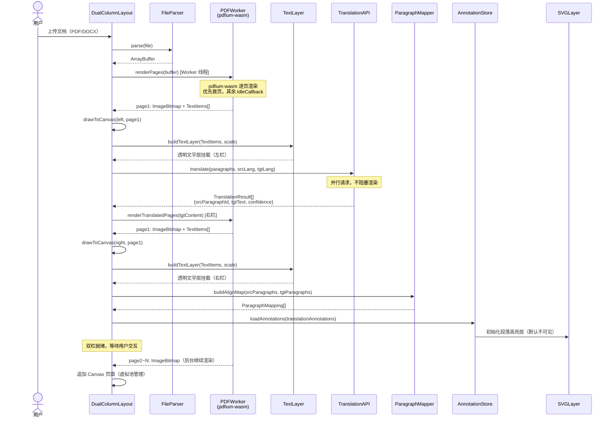
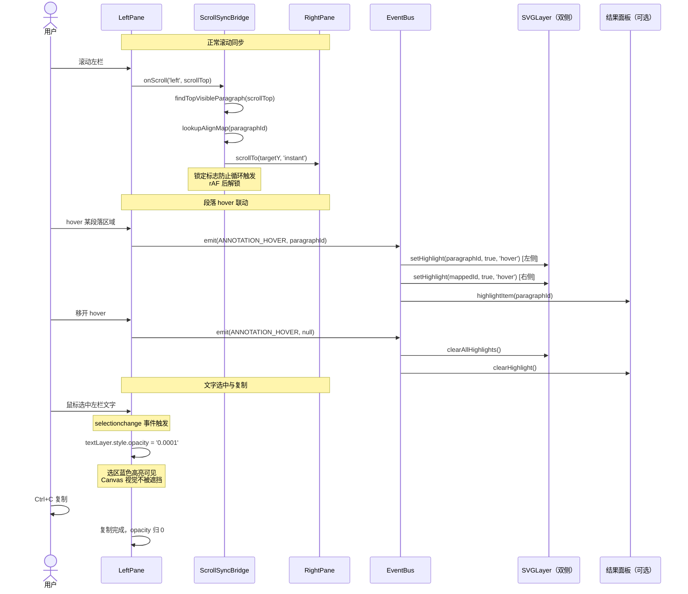
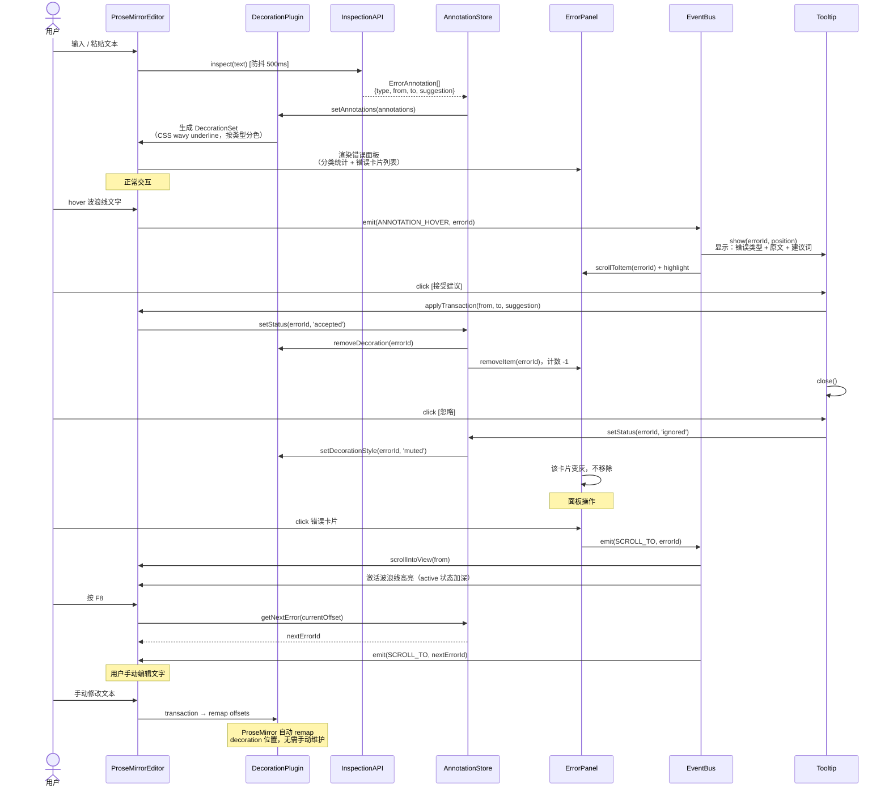
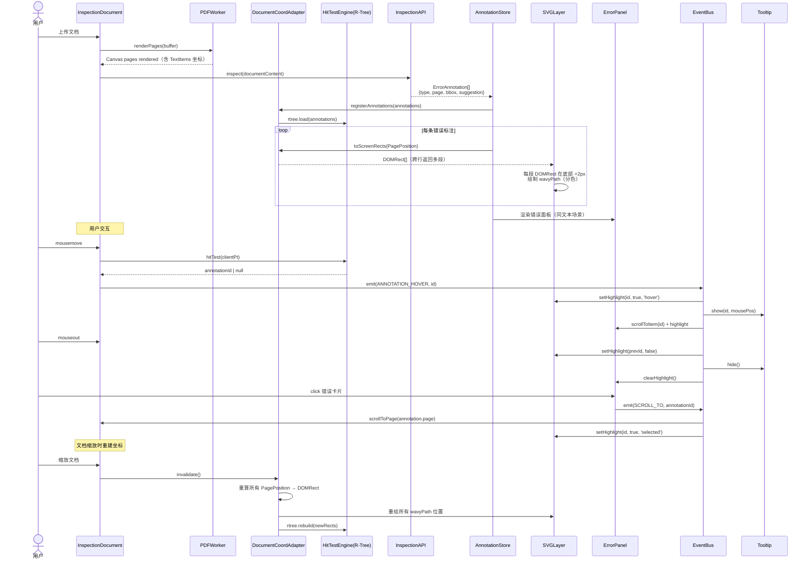
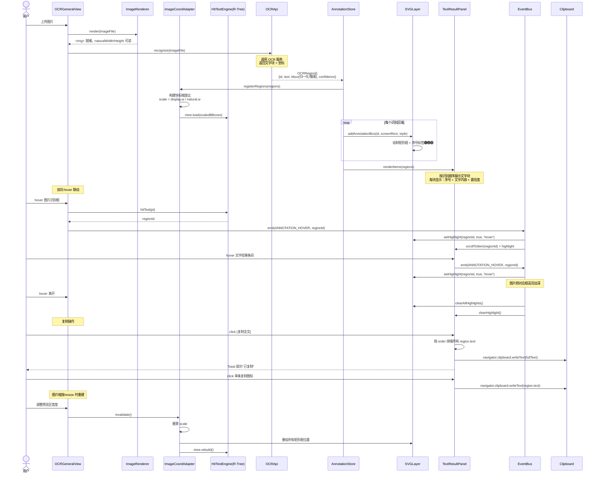
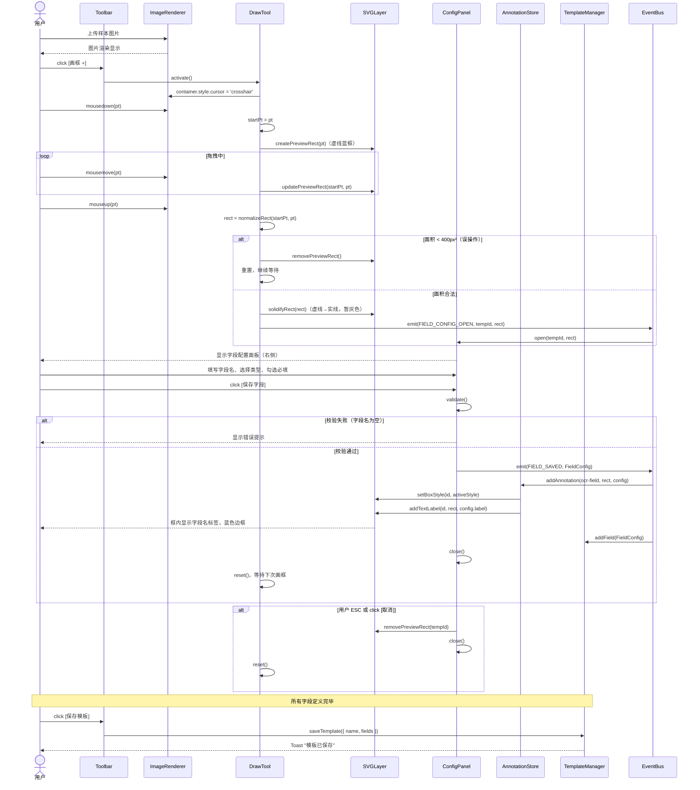
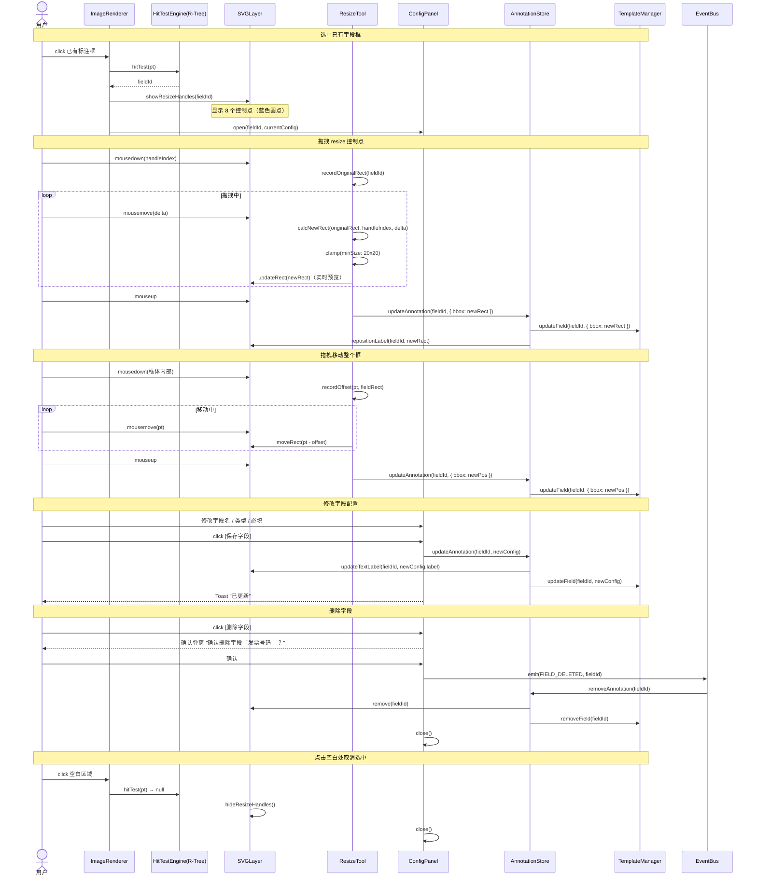

# 多模态 AI 渲染引擎 — 时序图

> 使用 Mermaid 语法，可在 GitHub / VSCode / Obsidian 等工具渲染

---

## 时序图索引

1. [翻译双栏 — 文档加载与渲染](#1-翻译双栏--文档加载与渲染)
2. [翻译双栏 — 滚动同步与段落联动](#2-翻译双栏--滚动同步与段落联动)
3. [智检 — 纯文本场景](#3-智检--纯文本场景)
4. [智检 — 文档场景](#4-智检--文档场景)
5. [OCR 通用 — 图片识别与双向联动](#5-ocr-通用--图片识别与双向联动)
6. [OCR 自定义 — 创建字段模板](#6-ocr-自定义--创建字段模板)
7. [OCR 自定义 — 编辑与删除字段](#7-ocr-自定义--编辑与删除字段)

---

## 1. 翻译双栏 — 文档加载与渲染

---

## 2. 翻译双栏 — 滚动同步与段落联动

---

## 3. 智检 — 纯文本场景

---

## 4. 智检 — 文档场景

---

## 5. OCR 通用 — 图片识别与双向联动

---

## 6. OCR 自定义 — 创建字段模板

---

## 7. OCR 自定义 — 编辑与删除字段

---

## 附：Actor 说明

| Actor | 说明 |
|-------|------|
| DualColumnLayout | 翻译双栏主容器组件 |
| PDFWorker | pdfium-wasm 运行在 Web Worker 中的渲染器 |
| TextLayer | 透明 DOM 文字层，用于原生文本选择与复制 |
| ScrollSyncBridge | 双栏滚动同步控制器 |
| ParagraphMapper | 原文/译文段落对齐映射构建器 |
| InspectionDocument | 文档智检主视图 |
| DocumentCoordAdapter | 文档场景坐标适配器（页面坐标→屏幕坐标）|
| ImageCoordAdapter | 图片场景坐标适配器（像素坐标→屏幕坐标）|
| HitTestEngine | 基于 R-Tree 的空间索引命中检测引擎 |
| SVGLayer | SVG 标注层工厂（波浪线、矩形框、标签）|
| AnnotationStore | 全局标注数据状态管理 |
| StateMachine | 交互状态机（idle/hover/selected/drawing）|
| EventBus | 跨组件事件总线（双向联动核心）|
| DrawTool | OCR 自定义矩形画框工具 |
| ResizeTool | 矩形控制点缩放/移动工具 |
| ConfigPanel | 字段属性配置面板 |
| TemplateManager | OCR 模板 CRUD 管理器 |
| ErrorPanel | 智检错误列表面板 |
| TextResultPanel | OCR 通用识别文字结果面板 |
| DecorationPlugin | ProseMirror 标注渲染插件 |
